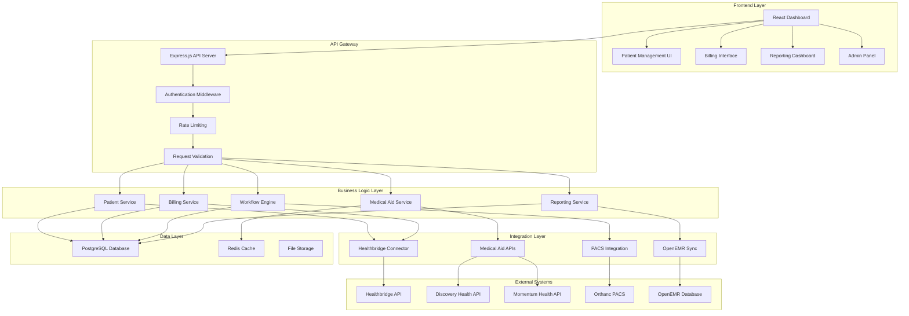

# Design Document

## Overview

The South African OpenEMR RIS and Medical Billing System is designed as a comprehensive, production-ready healthcare management platform that integrates seamlessly with South African medical aid schemes, the Healthbridge clearing house, and PACS systems. The architecture follows modern web development principles with a React-based frontend, Node.js/Express backend, and PostgreSQL database, ensuring scalability, maintainability, and professional-grade performance.

The system is built to compete with established healthcare software providers by offering superior user experience, real-time integrations, and South African-specific functionality that addresses the unique requirements of the local healthcare market.

## Architecture

### System Architecture Overview



### Technology Stack

**Frontend:**
- React 18 with TypeScript for type safety and modern development
- Material-UI (MUI) for professional, accessible UI components
- React Query for efficient data fetching and caching
- React Hook Form for form management and validation
- Chart.js for financial reporting and analytics
- Socket.io client for real-time updates

**Backend:**
- Node.js with Express.js for robust API development
- TypeScript for type safety and better code maintainability
- Prisma ORM for database management and migrations
- Socket.io for real-time communication
- Bull Queue for background job processing
- Winston for comprehensive logging
- Helmet for security headers

**Database:**
- PostgreSQL for primary data storage with ACID compliance
- Redis for caching and session management
- Elasticsearch for advanced search capabilities

**Infrastructure:**
- Docker containers for consistent deployment
- Nginx for reverse proxy and load balancing
- SSL/TLS encryption for all communications
- Automated backups with point-in-time recovery

## Components and Interfaces

### Frontend Components

#### 1. Dashboard Component
- **Purpose:** Main landing page with key metrics and quick actions
- **Features:** Real-time statistics, recent activities, system status indicators
- **Props:** User role, permissions, real-time data subscriptions
- **State Management:** Global state for user session, local state for dashboard metrics

#### 2. Patient Management Component
- **Purpose:** Comprehensive patient registration, search, and management
- **Features:** Patient search, medical aid verification, appointment scheduling
- **Subcomponents:** PatientForm, MedicalAidVerification, AppointmentScheduler
- **Integration:** Real-time medical aid API calls, PACS patient matching

#### 3. Billing Management Component
- **Purpose:** Complete billing workflow from procedure coding to claim submission
- **Features:** NRPL code selection, ICD-10 validation, claim generation
- **Subcomponents:** ProcedureSelector, DiagnosisCodePicker, ClaimBuilder
- **Integration:** Healthbridge API, medical aid pre-authorization

#### 4. Workflow Engine Component
- **Purpose:** Visual workflow management for radiology procedures
- **Features:** Drag-and-drop workflow builder, status tracking, notifications
- **Subcomponents:** WorkflowCanvas, StatusTracker, NotificationCenter
- **Integration:** PACS status updates, OpenEMR synchronization

#### 5. Reporting Dashboard Component
- **Purpose:** Financial and operational reporting with interactive charts
- **Features:** Custom report builder, export functionality, scheduled reports
- **Subcomponents:** ReportBuilder, ChartRenderer, ExportManager
- **Integration:** Database analytics, external system data aggregation

### Backend Services

#### 1. Patient Service
```typescript
interface PatientService {
  createPatient(patientData: PatientCreateDTO): Promise<Patient>;
  updatePatient(id: string, updates: PatientUpdateDTO): Promise<Patient>;
  searchPatients(criteria: SearchCriteria): Promise<Patient[]>;
  verifyMedicalAid(patientId: string): Promise<MedicalAidStatus>;
  getPatientHistory(patientId: string): Promise<PatientHistory>;
}
```

#### 2. Billing Service
```typescript
interface BillingService {
  calculateBilling(procedures: Procedure[]): Promise<BillingCalculation>;
  generateClaim(claimData: ClaimCreateDTO): Promise<Claim>;
  submitClaim(claimId: string): Promise<SubmissionResult>;
  trackClaimStatus(claimId: string): Promise<ClaimStatus>;
  reconcilePayments(): Promise<ReconciliationResult>;
}
```

#### 3. Medical Aid Service
```typescript
interface MedicalAidService {
  verifyMembership(memberNumber: string, scheme: string): Promise<MembershipStatus>;
  checkBenefits(memberNumber: string, procedure: string): Promise<BenefitStatus>;
  requestPreAuthorization(authRequest: PreAuthRequest): Promise<AuthorizationResult>;
  getSchemeRules(schemeCode: string): Promise<SchemeRules>;
}
```

#### 4. Workflow Engine Service
```typescript
interface WorkflowEngineService {
  createWorkflow(workflowData: WorkflowCreateDTO): Promise<Workflow>;
  executeStep(workflowId: string, stepId: string): Promise<StepResult>;
  getWorkflowStatus(workflowId: string): Promise<WorkflowStatus>;
  handleWorkflowEvents(event: WorkflowEvent): Promise<void>;
}
```

### Integration Interfaces

#### 1. Healthbridge Connector
```typescript
interface HealthbridgeConnector {
  submitClaim(claim: HealthbridgeClaim): Promise<SubmissionResponse>;
  checkClaimStatus(referenceNumber: string): Promise<ClaimStatusResponse>;
  downloadRemittance(): Promise<RemittanceData[]>;
  validateMember(memberDetails: MemberValidation): Promise<ValidationResponse>;
}
```

#### 2. Medical Aid API Connectors
```typescript
interface MedicalAidConnector {
  authenticate(): Promise<AuthToken>;
  verifyMember(memberNumber: string): Promise<MemberVerificationResponse>;
  submitPreAuth(preAuthRequest: PreAuthorizationRequest): Promise<PreAuthResponse>;
  checkBenefits(memberNumber: string, procedureCode: string): Promise<BenefitResponse>;
}
```

## Data Models

### Core Entities

#### Patient Model
```typescript
interface Patient {
  id: string;
  personalDetails: {
    firstName: string;
    lastName: string;
    idNumber: string;
    dateOfBirth: Date;
    gender: 'M' | 'F' | 'O';
    contactDetails: ContactDetails;
  };
  medicalAid: {
    scheme: string;
    memberNumber: string;
    dependentCode?: string;
    status: 'ACTIVE' | 'INACTIVE' | 'SUSPENDED';
    benefitStatus: BenefitStatus;
  };
  clinicalInfo: {
    allergies: string[];
    chronicConditions: string[];
    currentMedications: string[];
  };
  auditTrail: AuditEntry[];
  createdAt: Date;
  updatedAt: Date;
}
```

#### Study Order Model
```typescript
interface StudyOrder {
  id: string;
  patientId: string;
  orderingPhysician: string;
  procedure: {
    code: string;
    description: string;
    nrplCode: string;
    tariff: number;
  };
  clinicalInfo: {
    indication: string;
    icd10Codes: string[];
    urgency: 'ROUTINE' | 'URGENT' | 'STAT';
  };
  scheduling: {
    preferredDate?: Date;
    scheduledDate?: Date;
    estimatedDuration: number;
    specialInstructions?: string;
  };
  status: 'ORDERED' | 'SCHEDULED' | 'IN_PROGRESS' | 'COMPLETED' | 'CANCELLED';
  workflow: WorkflowStep[];
  createdAt: Date;
  updatedAt: Date;
}
```

#### Claim Model
```typescript
interface Claim {
  id: string;
  claimNumber: string;
  patientId: string;
  studyOrderId: string;
  medicalAid: {
    scheme: string;
    memberNumber: string;
    preAuthNumber?: string;
  };
  billing: {
    procedures: BilledProcedure[];
    totalAmount: number;
    vatAmount: number;
    netAmount: number;
  };
  submission: {
    healthbridgeReference?: string;
    submittedAt?: Date;
    status: 'DRAFT' | 'SUBMITTED' | 'PROCESSING' | 'PAID' | 'REJECTED';
    rejectionReason?: string;
  };
  payments: Payment[];
  auditTrail: AuditEntry[];
  createdAt: Date;
  updatedAt: Date;
}
```

### Supporting Models

#### Medical Aid Scheme Configuration
```typescript
interface MedicalAidScheme {
  code: string;
  name: string;
  apiEndpoint: string;
  authenticationMethod: 'API_KEY' | 'OAUTH2' | 'BASIC';
  credentials: Record<string, string>;
  preAuthRequired: string[]; // Procedure codes requiring pre-auth
  billingRules: BillingRule[];
  contactInfo: ContactDetails;
  isActive: boolean;
}
```

#### NRPL Code Database
```typescript
interface NRPLCode {
  code: string;
  description: string;
  category: string;
  baseRate: number;
  vatApplicable: boolean;
  modifiers: CodeModifier[];
  effectiveDate: Date;
  expiryDate?: Date;
  relatedICD10Codes: string[];
}
```

## Error Handling

### Error Classification System

#### 1. Business Logic Errors
- **Patient Validation Errors:** Invalid ID numbers, duplicate registrations
- **Medical Aid Errors:** Invalid member numbers, benefit exhaustion
- **Billing Errors:** Invalid procedure codes, calculation errors
- **Workflow Errors:** Invalid state transitions, missing prerequisites

#### 2. Integration Errors
- **API Timeout Errors:** Healthbridge or medical aid API timeouts
- **Authentication Errors:** Invalid credentials, expired tokens
- **Data Format Errors:** Invalid response formats, missing required fields
- **Network Errors:** Connection failures, DNS resolution issues

#### 3. System Errors
- **Database Errors:** Connection failures, constraint violations
- **File System Errors:** Storage failures, permission issues
- **Memory Errors:** Out of memory conditions, resource exhaustion
- **Security Errors:** Unauthorized access attempts, token validation failures

### Error Handling Strategy

#### Frontend Error Handling
```typescript
interface ErrorBoundary {
  componentDidCatch(error: Error, errorInfo: ErrorInfo): void;
  render(): ReactNode;
}

interface ErrorNotification {
  type: 'ERROR' | 'WARNING' | 'INFO';
  message: string;
  details?: string;
  actions?: ErrorAction[];
  autoHide?: boolean;
}
```

#### Backend Error Handling
```typescript
interface ErrorHandler {
  handleBusinessError(error: BusinessError): ErrorResponse;
  handleIntegrationError(error: IntegrationError): ErrorResponse;
  handleSystemError(error: SystemError): ErrorResponse;
  logError(error: Error, context: ErrorContext): void;
}

interface ErrorResponse {
  success: false;
  error: {
    code: string;
    message: string;
    details?: Record<string, any>;
    timestamp: Date;
    requestId: string;
  };
}
```

## Testing Strategy

### Unit Testing
- **Frontend:** Jest and React Testing Library for component testing
- **Backend:** Jest for service and utility function testing
- **Coverage Target:** Minimum 90% code coverage for critical business logic
- **Mocking:** Mock external APIs and database calls for isolated testing

### Integration Testing
- **API Testing:** Supertest for endpoint testing with real database
- **Database Testing:** Test database migrations and data integrity
- **External API Testing:** Mock external services with realistic responses
- **Workflow Testing:** End-to-end workflow execution testing

### End-to-End Testing
- **User Journey Testing:** Cypress for complete user workflow testing
- **Cross-browser Testing:** Automated testing across Chrome, Firefox, Safari
- **Mobile Responsiveness:** Testing on various device sizes and orientations
- **Performance Testing:** Load testing with realistic user scenarios

### Security Testing
- **Authentication Testing:** Test login, logout, and session management
- **Authorization Testing:** Verify role-based access controls
- **Input Validation Testing:** Test for SQL injection, XSS vulnerabilities
- **Data Encryption Testing:** Verify encryption at rest and in transit

### South African Specific Testing
- **Medical Aid Integration Testing:** Test with real medical aid APIs in sandbox mode
- **Healthbridge Testing:** Validate claim submission and status tracking
- **ICD-10 Validation Testing:** Test with South African ICD-10 code database
- **NRPL Calculation Testing:** Verify accurate billing calculations with current tariffs

## Performance Considerations

### Frontend Performance
- **Code Splitting:** Lazy loading of components and routes
- **Memoization:** React.memo and useMemo for expensive calculations
- **Virtual Scrolling:** For large patient lists and data tables
- **Image Optimization:** Compressed images and lazy loading
- **Bundle Optimization:** Tree shaking and minification

### Backend Performance
- **Database Optimization:** Proper indexing and query optimization
- **Caching Strategy:** Redis for frequently accessed data
- **Connection Pooling:** Efficient database connection management
- **Background Jobs:** Queue processing for heavy operations
- **API Rate Limiting:** Prevent abuse and ensure fair usage

### Real-time Performance
- **WebSocket Optimization:** Efficient real-time communication
- **Event Debouncing:** Prevent excessive API calls
- **Data Pagination:** Efficient handling of large datasets
- **Incremental Updates:** Only send changed data to clients

## Security Architecture

### Authentication and Authorization
- **Multi-factor Authentication:** SMS and email-based 2FA
- **Role-based Access Control:** Granular permissions system
- **Session Management:** Secure session handling with Redis
- **Password Policies:** Strong password requirements and rotation

### Data Protection
- **Encryption at Rest:** AES-256 encryption for sensitive data
- **Encryption in Transit:** TLS 1.3 for all communications
- **Data Masking:** Sensitive data masking in logs and exports
- **Audit Logging:** Comprehensive audit trails for all data access

### POPIA Compliance
- **Data Minimization:** Collect only necessary patient information
- **Consent Management:** Explicit consent tracking and management
- **Right to Erasure:** Secure data deletion capabilities
- **Data Portability:** Export patient data in standard formats
- **Breach Notification:** Automated breach detection and notification

### API Security
- **Rate Limiting:** Prevent API abuse and DDoS attacks
- **Input Validation:** Comprehensive input sanitization
- **CORS Configuration:** Proper cross-origin resource sharing setup
- **API Versioning:** Maintain backward compatibility and security updates