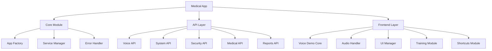

# Design Document

## Overview

This design addresses the critical issues in the medical reporting module by implementing a systematic approach to fix JavaScript syntax errors, modularize oversized files, restore STT functionality, and implement missing API endpoints. The solution focuses on maintainability, error handling, and proper separation of concerns.

## Architecture

### Current Issues Analysis
1. **JavaScript Syntax Error**: The voice-demo.js file has a structural issue around line 1488 where an object literal appears without proper context
2. **File Size**: The voice-demo.js file is 2670+ lines, making it difficult to maintain and debug
3. **Missing APIs**: Several API endpoints are missing, causing startup warnings
4. **STT Functionality**: Speech-to-text features are broken due to the JavaScript errors

### Proposed Solution Architecture



## Components and Interfaces

### 1. JavaScript Modularization

#### Core Voice Demo Module (`voice-demo-core.js`)
- Main class initialization and configuration
- Event handling setup
- Session management
- **Size Target**: < 300 lines

#### Audio Processing Module (`audio-processor.js`)
- Audio recording and processing
- Format conversion (WebM to WAV)
- Audio visualization
- **Size Target**: < 250 lines

#### UI Management Module (`ui-manager.js`)
- DOM manipulation
- Status updates
- Template loading
- User feedback
- **Size Target**: < 200 lines

#### Training Module (`training-handler.js`)
- Voice training functionality
- Medical term learning
- Progress tracking
- **Size Target**: < 200 lines

#### Shortcuts Module (`shortcuts-manager.js`)
- Voice shortcuts processing
- Custom command handling
- Shortcut management
- **Size Target**: < 150 lines

### 2. API Implementation

#### Missing API Endpoints
- **System API**: Health checks, service status
- **Security API**: Authentication, authorization
- **Medical Standards API**: Medical terminology, templates
- **Reports API**: Report generation, storage

#### API Structure
```python
# Each API follows this pattern:
from flask import Blueprint, jsonify, request

api_bp = Blueprint('api_name', __name__)

@api_bp.route('/endpoint')
def endpoint_handler():
    try:
        # Implementation
        return jsonify({'success': True, 'data': result})
    except Exception as e:
        return jsonify({'success': False, 'error': str(e)}), 500
```

### 3. Error Handling Strategy

#### JavaScript Error Handling
- Try-catch blocks around all async operations
- Graceful degradation for missing features
- User-friendly error messages
- Comprehensive logging

#### Python Error Handling
- Centralized error handler in app factory
- Structured error responses
- Logging with appropriate levels
- Graceful service degradation

## Data Models

### JavaScript Module Structure
```javascript
// Base module pattern
class ModuleName {
    constructor(config = {}) {
        this.config = config;
        this.initialize();
    }
    
    initialize() {
        // Setup logic
    }
    
    // Public methods
    
    // Private methods (prefixed with _)
}

export default ModuleName;
```

### API Response Format
```json
{
    "success": boolean,
    "data": object | array | null,
    "error": string | null,
    "timestamp": string,
    "request_id": string
}
```

## Error Handling

### JavaScript Error Categories
1. **Syntax Errors**: Fixed during refactoring
2. **Runtime Errors**: Caught and handled gracefully
3. **Network Errors**: Retry logic and offline handling
4. **User Errors**: Validation and feedback

### Python Error Categories
1. **Import Errors**: Graceful degradation for missing modules
2. **Database Errors**: Connection handling and retries
3. **API Errors**: Structured error responses
4. **Service Errors**: Health checks and fallbacks

### Error Recovery Strategies
- **Automatic Retry**: For transient network issues
- **Fallback Modes**: When services are unavailable
- **User Notification**: Clear error messages and recovery steps
- **Logging**: Comprehensive error tracking for debugging

## Testing Strategy

### JavaScript Testing
1. **Syntax Validation**: ESLint configuration
2. **Unit Tests**: Jest for individual modules
3. **Integration Tests**: Testing module interactions
4. **Browser Testing**: Cross-browser compatibility

### Python Testing
1. **Unit Tests**: pytest for individual functions
2. **API Tests**: Testing all endpoints
3. **Integration Tests**: Full application flow
4. **Error Handling Tests**: Ensuring graceful failures

### Test Coverage Goals
- **JavaScript**: > 80% code coverage
- **Python**: > 85% code coverage
- **Critical Paths**: 100% coverage (STT, API endpoints)

## Implementation Phases

### Phase 1: Critical Fixes
1. Fix JavaScript syntax error immediately
2. Implement basic missing APIs
3. Restore STT functionality
4. Basic error handling

### Phase 2: Modularization
1. Split voice-demo.js into modules
2. Implement module loading system
3. Update HTML templates
4. Test module interactions

### Phase 3: Enhancement
1. Improve error handling
2. Add comprehensive logging
3. Implement health checks
4. Performance optimization

### Phase 4: Testing & Documentation
1. Comprehensive test suite
2. Documentation updates
3. Code review and cleanup
4. Performance monitoring