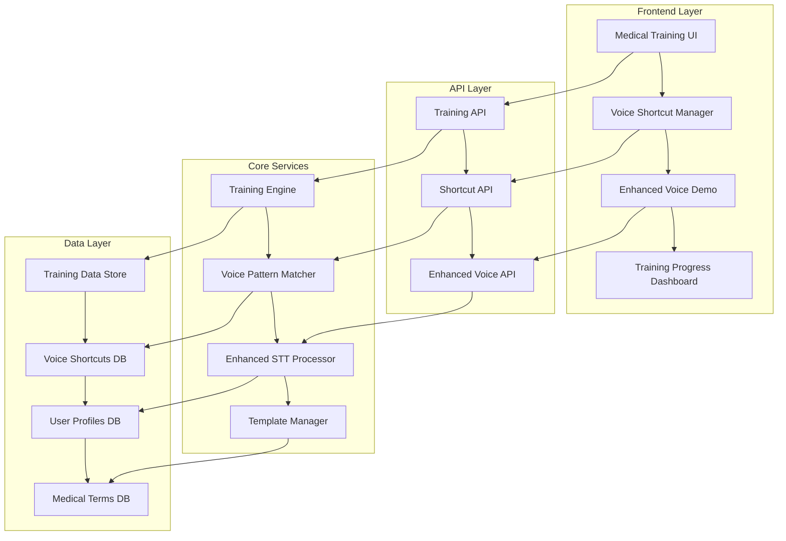

# Design Document

## Overview

The Medical STT Enhancements feature extends the existing medical reporting system with two key components: a Medical Terminology Training Module and a Voice Shortcut System. These enhancements leverage the current Flask-based architecture with SocketIO support, building upon the existing Whisper-based STT engine to provide personalized accuracy improvements and workflow optimization for medical professionals.

The design integrates seamlessly with the current voice API infrastructure while adding new endpoints and UI components for training and shortcut management. The system maintains the existing session-based architecture and extends it with user-specific training data and voice pattern recognition capabilities.

## Architecture

### System Components



### Integration Points

The enhancement integrates with existing components:

- **Voice API (`voice_api.py`)**: Extended with training and shortcut endpoints
- **Frontend (`voice-demo.js`)**: Enhanced with training and shortcut UI components
- **Session Management**: Leverages existing session system for training context
- **Database**: Extends current SQLite structure with new tables for training data and shortcuts

## Components and Interfaces

### 1. Medical Terminology Training Module

#### Training Engine (`core/training_engine.py`)
```python
class MedicalTrainingEngine:
    def __init__(self, whisper_model, user_id):
        self.whisper_model = whisper_model
        self.user_id = user_id
        self.training_data = TrainingDataStore(user_id)
    
    def process_training_audio(self, audio_data, expected_term):
        """Process training audio and update user-specific model adaptations"""
        
    def get_training_categories(self):
        """Return organized medical term categories"""
        
    def calculate_accuracy_improvement(self):
        """Calculate user's STT accuracy improvements from training"""
```

#### Training Data Store (`models/training_data.py`)
```python
class TrainingDataStore:
    def store_training_session(self, user_id, term, audio_features, accuracy_score):
        """Store training session data for model improvement"""
        
    def get_user_training_progress(self, user_id):
        """Retrieve user's training progress and statistics"""
        
    def get_problematic_terms(self, user_id):
        """Identify terms that need additional training"""
```

### 2. Voice Shortcut System

#### Voice Pattern Matcher (`core/voice_matcher.py`)
```python
class VoicePatternMatcher:
    def __init__(self, user_id):
        self.user_id = user_id
        self.shortcuts = VoiceShortcutStore(user_id)
        
    def register_voice_shortcut(self, audio_data, shortcut_name, template_id):
        """Register a new voice shortcut with audio pattern"""
        
    def match_voice_command(self, audio_data, confidence_threshold=0.8):
        """Match incoming audio against registered shortcuts"""
        
    def update_shortcut_accuracy(self, shortcut_id, match_success):
        """Update shortcut matching accuracy based on usage"""
```

#### Voice Shortcut Store (`models/voice_shortcuts.py`)
```python
class VoiceShortcutStore:
    def create_shortcut(self, user_id, name, audio_features, template_id):
        """Create new voice shortcut"""
        
    def get_user_shortcuts(self, user_id):
        """Retrieve all shortcuts for a user"""
        
    def delete_shortcut(self, shortcut_id, user_id):
        """Delete a voice shortcut"""
```

### 3. Enhanced STT Processor

#### Medical STT Enhancer (`core/medical_stt_enhancer.py`)
```python
class MedicalSTTEnhancer:
    def __init__(self, base_whisper_model):
        self.base_model = base_whisper_model
        self.medical_terms_db = MedicalTermsDatabase()
        
    def enhance_transcription_with_training(self, transcription, user_training_data):
        """Apply user-specific training improvements to transcription"""
        
    def apply_medical_context(self, transcription, medical_context):
        """Apply medical terminology corrections with user context"""
        
    def detect_voice_shortcuts(self, audio_data, user_shortcuts):
        """Detect if audio contains a voice shortcut command"""
```

## Data Models

### Training Data Schema

```sql
-- User training sessions
CREATE TABLE training_sessions (
    id INTEGER PRIMARY KEY AUTOINCREMENT,
    user_id TEXT NOT NULL,
    medical_term TEXT NOT NULL,
    audio_path TEXT,
    audio_features BLOB,
    expected_transcription TEXT,
    actual_transcription TEXT,
    accuracy_score REAL,
    session_date DATETIME DEFAULT CURRENT_TIMESTAMP,
    category TEXT
);

-- Medical terms database
CREATE TABLE medical_terms (
    id INTEGER PRIMARY KEY AUTOINCREMENT,
    term TEXT UNIQUE NOT NULL,
    category TEXT NOT NULL,
    pronunciation_guide TEXT,
    common_variations TEXT,
    difficulty_level INTEGER DEFAULT 1
);

-- User training progress
CREATE TABLE user_training_progress (
    user_id TEXT PRIMARY KEY,
    total_sessions INTEGER DEFAULT 0,
    accuracy_improvement REAL DEFAULT 0.0,
    last_training_date DATETIME,
    problematic_terms TEXT, -- JSON array
    completed_categories TEXT -- JSON array
);
```

### Voice Shortcuts Schema

```sql
-- Voice shortcuts
CREATE TABLE voice_shortcuts (
    id INTEGER PRIMARY KEY AUTOINCREMENT,
    user_id TEXT NOT NULL,
    shortcut_name TEXT NOT NULL,
    audio_features BLOB NOT NULL,
    template_id TEXT,
    template_content TEXT,
    created_date DATETIME DEFAULT CURRENT_TIMESTAMP,
    last_used DATETIME,
    usage_count INTEGER DEFAULT 0,
    accuracy_score REAL DEFAULT 0.0
);

-- Shortcut usage analytics
CREATE TABLE shortcut_usage (
    id INTEGER PRIMARY KEY AUTOINCREMENT,
    shortcut_id INTEGER,
    user_id TEXT,
    used_date DATETIME DEFAULT CURRENT_TIMESTAMP,
    match_confidence REAL,
    success BOOLEAN,
    FOREIGN KEY (shortcut_id) REFERENCES voice_shortcuts (id)
);
```

### Medical Terms Categories

```json
{
  "anatomy": [
    "cardiovascular system", "respiratory system", "gastrointestinal tract",
    "central nervous system", "musculoskeletal system", "genitourinary system"
  ],
  "conditions": [
    "hypertension", "diabetes mellitus", "myocardial infarction",
    "pneumonia", "tuberculosis", "HIV/AIDS", "chronic kidney disease"
  ],
  "procedures": [
    "chest X-ray", "CT scan", "MRI scan", "echocardiogram",
    "electrocardiogram", "blood pressure measurement", "pulse oximetry"
  ],
  "medications": [
    "antihypertensives", "antibiotics", "analgesics", "antiretrovirals",
    "bronchodilators", "diuretics", "beta-blockers"
  ],
  "sa_specific": [
    "clinic sister", "community health worker", "traditional healer",
    "motor vehicle accident", "gunshot wound", "traditional medicine"
  ]
}
```

## Error Handling

### Training Module Error Handling

1. **Audio Processing Errors**
   - Fallback to basic STT if training enhancement fails
   - Log training failures for system improvement
   - Provide user feedback on audio quality issues

2. **Training Data Corruption**
   - Validate training data integrity on load
   - Backup and recovery mechanisms for user training progress
   - Graceful degradation to untrained STT

3. **Model Loading Failures**
   - Cache training improvements locally
   - Retry mechanisms for training data synchronization
   - Offline training capability with sync when online

### Voice Shortcuts Error Handling

1. **Pattern Matching Failures**
   - Confidence threshold adjustments based on user feedback
   - Fallback to similarity matching for partial matches
   - Learning from false positives and negatives

2. **Template Loading Errors**
   - Validate template existence before shortcut creation
   - Backup template storage for critical shortcuts
   - User notification for broken shortcut associations

3. **Audio Quality Issues**
   - Audio quality assessment before shortcut registration
   - Re-recording prompts for poor quality audio
   - Noise reduction preprocessing for shortcut matching

## Testing Strategy

### Unit Testing

1. **Training Engine Tests**
   ```python
   def test_training_audio_processing():
       # Test audio feature extraction
       # Test accuracy calculation
       # Test training data storage
   
   def test_medical_term_categorization():
       # Test term organization
       # Test category retrieval
       # Test difficulty assessment
   ```

2. **Voice Shortcut Tests**
   ```python
   def test_shortcut_registration():
       # Test audio pattern storage
       # Test template association
       # Test duplicate handling
   
   def test_pattern_matching():
       # Test exact matches
       # Test partial matches
       # Test false positive handling
   ```

### Integration Testing

1. **End-to-End Training Flow**
   - User selects medical terms category
   - Records training audio for multiple terms
   - System processes and stores training data
   - Improved accuracy in subsequent STT sessions

2. **Voice Shortcut Workflow**
   - User records voice shortcut
   - Associates with template
   - Uses shortcut during report creation
   - Template loads correctly with cursor positioning

### Performance Testing

1. **Training Performance**
   - Audio processing latency under 2 seconds
   - Training data storage within 500ms
   - Memory usage optimization for large training datasets

2. **Shortcut Matching Performance**
   - Pattern matching under 1 second
   - Concurrent shortcut processing
   - Database query optimization for large shortcut collections

### User Acceptance Testing

1. **Medical Professional Feedback**
   - Accuracy improvement measurement
   - Workflow efficiency assessment
   - User interface usability evaluation

2. **South African Medical Context**
   - SA English pronunciation handling
   - Local medical terminology accuracy
   - Cultural context appropriateness

## Security Considerations

### Data Privacy
- User training data encrypted at rest
- Voice shortcuts stored with user-specific encryption
- POPIA compliance for medical data handling
- Secure deletion of training audio files

### Access Control
- User-specific training data isolation
- Role-based access to training management
- Audit logging for training data access
- Session-based authentication for training features

### Audio Data Security
- Temporary audio file secure deletion
- Voice pattern anonymization options
- Secure transmission of training audio
- Local processing preference for sensitive data