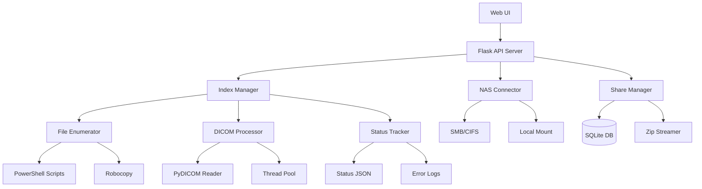

# Design Document

## Overview

The Orthanc NAS PACS fix will address performance and reliability issues in the current NAS integration system. The solution focuses on optimizing file enumeration, implementing robust concurrent indexing, providing real-time progress monitoring, and completing the secure sharing functionality.

The design leverages existing components while fixing critical performance bottlenecks and completing missing features. The system will maintain backward compatibility while significantly improving user experience.

## Architecture

### High-Level Architecture



### Component Interactions

1. **Web UI** initiates indexing requests and polls for status updates
2. **Index Manager** orchestrates the enumeration and processing pipeline
3. **File Enumerator** uses optimized native tools for fast file discovery
4. **DICOM Processor** reads headers concurrently with configurable threading
5. **Status Tracker** provides real-time progress updates and error reporting
6. **Share Manager** handles secure link creation and file streaming

## Components and Interfaces

### 1. Enhanced File Enumerator

**Purpose**: Fast, reliable enumeration of DICOM files on NAS shares

**Key Features**:
- Dual enumeration strategies: PowerShell Get-ChildItem and Robocopy
- Automatic fallback between methods based on performance
- SMB-optimized parameters for network efficiency
- Progress reporting during enumeration

**Interface**:
```python
class EnhancedFileEnumerator:
    def enumerate_files(self, nas_path: str, method: str = "auto") -> List[str]
    def get_enumeration_progress(self) -> Dict[str, Any]
    def cancel_enumeration(self) -> bool
```

**Implementation Strategy**:
- Use robocopy with `/L /S /FP /NJH /NJS` flags for list-only mode
- Fallback to PowerShell Get-ChildItem with `-File -Recurse` for compatibility
- Filter files by DICOM extensions (.dcm, .dicom, .ima, no extension)
- Write results to temporary file for memory efficiency

### 2. Concurrent DICOM Indexer

**Purpose**: Process DICOM headers efficiently using parallel processing

**Key Features**:
- ThreadPoolExecutor with configurable worker count
- Header-only reading using pydicom stop_before_pixels=True
- Series grouping by SeriesInstanceUID with fallbacks
- Incremental progress saving and error handling

**Interface**:
```python
class ConcurrentDicomIndexer:
    def __init__(self, max_workers: int = 8)
    def index_files(self, file_paths: List[str], output_file: str) -> IndexResult
    def get_indexing_status(self) -> IndexStatus
    def pause_indexing(self) -> bool
    def resume_indexing(self) -> bool
```

**Data Structures**:
```python
@dataclass
class IndexStatus:
    enumerated_files: int
    files_processed: int
    series_count: int
    errors: int
    running: bool
    last_updated: str
    estimated_completion: Optional[str]

@dataclass
class SeriesEntry:
    SeriesKey: str
    PatientName: str
    PatientID: str
    StudyDescription: str
    SeriesDescription: str
    files: List[str]
    file_count: int
```

### 3. Real-Time Status API

**Purpose**: Provide live progress updates and system status

**Key Endpoints**:
- `POST /api/index/start` - Start indexing process
- `GET /api/index/status` - Get current progress
- `POST /api/index/cancel` - Cancel running process
- `GET /api/search?q=<query>` - Search indexed data

**Status Update Mechanism**:
- Write status to `index_status.json` every 50 processed files
- Use atomic file operations to prevent corruption
- Include error details and performance metrics
- Provide ETA calculations based on processing rate

### 4. Enhanced NAS Connector

**Purpose**: Reliable NAS connectivity with improved error handling

**Key Improvements**:
- Connection pooling for better performance
- Automatic retry logic with exponential backoff
- Better error classification and user-friendly messages
- Support for local mounting as fallback option

**Interface**:
```python
class EnhancedNASConnector:
    def test_connection(self) -> Tuple[bool, str, Dict[str, Any]]
    def get_connection_metrics(self) -> Dict[str, Any]
    def suggest_optimization(self) -> List[str]
```

### 5. Secure Share Manager

**Purpose**: Complete implementation of secure file sharing

**Key Features**:
- Token-based access with configurable expiration
- On-the-fly zip streaming without temporary files
- Access logging and audit trail
- Optional password protection

**Database Schema**:
```sql
CREATE TABLE shares (
    token TEXT PRIMARY KEY,
    series_key TEXT NOT NULL,
    created_by TEXT NOT NULL,
    created_at TIMESTAMP NOT NULL,
    expires_at TIMESTAMP NOT NULL,
    password_hash TEXT,
    access_count INTEGER DEFAULT 0,
    last_accessed TIMESTAMP
);

CREATE TABLE share_access_log (
    id INTEGER PRIMARY KEY AUTOINCREMENT,
    token TEXT NOT NULL,
    ip_address TEXT,
    user_agent TEXT,
    accessed_at TIMESTAMP NOT NULL,
    success BOOLEAN NOT NULL
);
```

**Interface**:
```python
class SecureShareManager:
    def create_share_link(self, series_key: str, user_id: str, 
                         expires_hours: int = 24, password: str = None) -> str
    def validate_share_token(self, token: str, password: str = None) -> bool
    def stream_shared_files(self, token: str) -> Iterator[bytes]
    def get_share_statistics(self) -> Dict[str, Any]
```

## Data Models

### Index Data Structure

The index will be stored as a JSON array of series objects:

```json
[
  {
    "SeriesKey": "1.2.840.113619.2.55.3.604688119.868.1234567890.123",
    "PatientName": "DOE^JOHN",
    "PatientID": "12345",
    "PatientBirthDate": "19800101",
    "StudyDate": "20240118",
    "StudyDescription": "CT CHEST W/O CONTRAST",
    "SeriesDescription": "AXIAL 5MM",
    "SeriesNumber": "2",
    "Modality": "CT",
    "files": [
      "\\\\nas\\share\\patient\\study\\series\\image1.dcm",
      "\\\\nas\\share\\patient\\study\\series\\image2.dcm"
    ],
    "file_count": 2
  }
]
```

### Configuration Schema

Enhanced NAS configuration with performance tuning:

```json
{
  "enabled": true,
  "type": "smb",
  "host": "192.168.1.100",
  "port": 445,
  "share": "medical_images",
  "username": "nas_user",
  "password": "nas_password",
  "domain": "WORKGROUP",
  "path": "/dicom",
  "timeout": 30,
  "retry_attempts": 3,
  "retry_delay": 5,
  "connection_pool_size": 5,
  "enumeration_method": "auto",
  "max_workers": 8,
  "chunk_size": 50,
  "performance_mode": "balanced"
}
```

## Error Handling

### Error Classification

1. **Network Errors**: Connection timeouts, DNS resolution failures
2. **Authentication Errors**: Invalid credentials, permission denied
3. **File System Errors**: Path not found, access denied, file corruption
4. **DICOM Errors**: Invalid DICOM files, missing required tags
5. **System Errors**: Out of memory, disk space, thread pool exhaustion

### Error Recovery Strategies

1. **Automatic Retry**: Network and temporary errors with exponential backoff
2. **Graceful Degradation**: Continue processing when individual files fail
3. **User Guidance**: Provide specific suggestions for configuration issues
4. **Fallback Options**: Suggest local mounting for SMB performance issues

### Error Reporting

```python
@dataclass
class ErrorReport:
    error_type: str
    error_code: str
    message: str
    suggestion: str
    file_path: Optional[str]
    timestamp: str
    retry_count: int
```

## Testing Strategy

### Unit Tests

1. **File Enumerator Tests**:
   - Test PowerShell and robocopy enumeration methods
   - Mock network failures and verify error handling
   - Test file filtering and path normalization

2. **DICOM Indexer Tests**:
   - Test concurrent processing with various thread counts
   - Test series grouping logic with edge cases
   - Test incremental status updates and atomic writes

3. **NAS Connector Tests**:
   - Test connection establishment and error scenarios
   - Test retry logic and backoff calculations
   - Test configuration validation and updates

### Integration Tests

1. **End-to-End Indexing**:
   - Test complete indexing workflow with sample DICOM files
   - Verify index accuracy and search functionality
   - Test progress reporting and status updates

2. **Share Management Tests**:
   - Test share link creation and validation
   - Test zip streaming with various file sizes
   - Test access logging and expiration handling

### Performance Tests

1. **Enumeration Performance**:
   - Benchmark enumeration speed with different methods
   - Test with various network conditions and file counts
   - Measure memory usage during large directory scans

2. **Indexing Throughput**:
   - Test concurrent processing with different worker counts
   - Measure processing rate for various DICOM file sizes
   - Test system resource utilization

### Load Tests

1. **Concurrent Users**: Test multiple simultaneous indexing operations
2. **Large Datasets**: Test with 100,000+ DICOM files
3. **Network Stress**: Test under various network conditions

## Performance Considerations

### Enumeration Optimization

1. **Native Tools**: Use robocopy and PowerShell for optimal SMB performance
2. **Streaming Results**: Write enumeration results to file to avoid memory issues
3. **Early Filtering**: Filter by file extensions during enumeration
4. **Parallel Enumeration**: Consider parallel enumeration of subdirectories

### Indexing Optimization

1. **Thread Pool Tuning**: Automatically adjust worker count based on network latency
2. **Batch Processing**: Process files in batches to optimize I/O
3. **Memory Management**: Use generators and streaming to minimize memory usage
4. **Caching**: Cache frequently accessed DICOM tags

### Network Optimization

1. **Connection Pooling**: Reuse SMB connections across threads
2. **Compression**: Enable SMB compression when available
3. **Local Mounting**: Provide guidance for mounting NAS as local drive
4. **Bandwidth Throttling**: Implement optional bandwidth limiting

## Security Considerations

### Access Control

1. **Authentication**: Verify user permissions before allowing indexing
2. **Authorization**: Implement role-based access to indexing functions
3. **Audit Logging**: Log all indexing operations and file access

### Data Protection

1. **Encryption**: Ensure SMB encryption is enabled when possible
2. **Secure Storage**: Hash share tokens and store securely
3. **Data Minimization**: Only extract necessary DICOM metadata
4. **Secure Deletion**: Properly clean up temporary files and status data

### Network Security

1. **TLS/SSL**: Use HTTPS for all API communications
2. **Input Validation**: Sanitize all user inputs and file paths
3. **Rate Limiting**: Implement rate limiting for API endpoints
4. **CSRF Protection**: Maintain CSRF protection for state-changing operations