# 🏥 Ubuntu Patient Care 🇿🇦
Your code can fight injustice. Your passion can heal a nation.

## 🏆 HACKATHON DEMO - Try It Now!

**🎯 For Judges & Evaluators:** Get started in 30 seconds!

[](https://gitpod.io/#https://github.com/Jobeer1/Ubuntu-Patient-Care)

### 🚀 Quick Setup Instructions:
1. **Click the Gitpod button above** - No local setup required!
2. **Wait for automatic setup** - Dependencies install automatically
3. **Run the setup script:** `bash setup_hackathon.sh`
4. **Start the system:** `python Orthanc/medical-reporting-module/core/app_factory.py`

### 🔧 Local Setup (Alternative):
```bash
git clone https://github.com/Jobeer1/Ubuntu-Patient-Care.git
cd Ubuntu-Patient-Care
bash setup_hackathon.sh
```

### 📝 Demo Features:
- ✅ **DICOM Medical Imaging Viewer** - Full PACS functionality
- ✅ **Voice-to-Text Medical Reporting** - AI-powered transcription
- ✅ **South African Medical Billing** - Complete RIS integration
- ✅ **Offline-First Design** - Works without internet
- ✅ **Open Source & Free** - No licensing fees

## 💔 The Problem. Our Problem.
This is a story you know. A doctor needs an ultrasound to save a life, but the machine is "end of life." A multi-billion dollar company, like Philips, tells you, "Sorry, we can't offer any services or parts. Please buy a new machine."

The frustration is real. Perfectly good machines are being decommissioned and shipped overseas as e-waste, deemed worthless by corporate mandates. Meanwhile, millions of our loved ones suffer because they cannot afford the systems that are built for profit, not for our people.

This is not a business problem. It's a moral failure of a system that serves those who can pay, while leaving millions of our loved ones behind.

## ✊ Our Mission. Our Rebellion.
We are a small team of passionate developers who said: **ENOUGH!**

We are building a free, open-source medical system to end this injustice. Ubuntu Patient Care is a comprehensive Radiology Information System (RIS), Picture Archiving and Communication System (PACS), and medical billing platform.

We are building it to be accessible, maintainable, and ethically sound.

🌍 Built for the people: Full offline functionality for clinics in remote areas with unreliable internet access.

💪 Built on strength: Powered by the open-source excellence of Orthanc, Whisper, and openEMR.

🇿🇦 Built for our reality: A system deeply tailored for the unique needs of South Africa 🇿🇦, where over 52 million people are excluded from quality healthcare.

## ❤️ Why Your Contribution Matters.
We are a small team of four from different countries, united by this purpose. We are fighting a massive, powerful enemy, but we have a secret weapon: **You**.

This isn't just about building software. It's about writing code that's helping to save lives of our loved ones.

**You can be a builder**: Your skills in Python, JavaScript, C++, or PHP can help us refine and expand a system that is saving lives.

**You can be a pioneer**: The world of open-source ML models is evolving. Your ideas can help us integrate the next generation of AI to make our system smarter, faster, and more life-saving.

**You can be a storyteller**: Your voice can amplify our mission. Share your experiences, your challenges, and your victories. Help us spread the word about Ubuntu Patient Care and the impact it's having.

**You can be part of a community**: Whether you're an unemployed person who wants to help with documentation or a seasoned developer, your contribution is invaluable. The more people who contribute, the more we all own this fight. It's the IKEA effect of compassion.

This isn't a one-time effort. It is a continuous rebellion. It is a long, hard fight. But every line of code you contribute, every bug you fix, and every idea you share is a stand against a system that puts profit over our loved ones.

## 🌟 World-First Features That Set Us Apart

### �*🇦 **Uniquely South African**
- **🗣️ 11 Official Languages Support** - Full interface in English, Afrikaans, isiZulu, isiXhosa, Sesotho, Setswana, Sepedi, Tshivenda, Xitsonga, siSwati, and isiNdebele
- **🤝 Ubuntu Care Philosophy** - Community-centered healthcare with family involvement
- **🌿 Traditional Medicine Integration** - World's first digital bridge between traditional African healing and modern medicine
- **⚡ Load Shedding Awareness** - Intelligent power management during South Africa's unique power challenges
- **🏛️ Complete Medical Aid Integration** - Direct integration with ALL major SA medical schemes

### 🚀 **Revolutionary Technology**
- **🔄 Offline-First Architecture** - Full functionality without internet connection
- **🏥 Advanced Patient Management** - Customized OpenEMR for South African workflows  
- **📸 Enterprise DICOM Storage** - Orthanc PACS with intelligent NAS integration
- **👁️ Professional Medical Imaging** - Browser-based DICOM viewer with AI enhancement
- **💰 Intelligent Billing System** - Automated claims processing for all SA medical aids
- **🔒 POPI Act Compliance** - Military-grade data protection and privacy compliance
- **📊 Real-Time Dashboard** - Live patient status and workflow management
- **🤖 AI-Powered Insights** - Predictive analytics for better patient outcomes

## 🚀 Quick Start

[](https://gitpod.io/#https://github.com/Jobeer1/Ubuntu-Patient-Care)

**🎯 For Hackathon Judges: Click the Gitpod button above to try our SA RIS system instantly!**

### Prerequisites
- Docker & Docker Compose
- Ubuntu 20.04+ or compatible Linux distribution
- Network Attached Storage (NAS) for image storage

### Installation

1. **Clone the repository:**
```bash
git clone https://github.com/Jobeer1/Ubuntu-Patient-Care.git
cd Ubuntu-Patient-Care
```

2. **Run setup script:**
```bash
# For Linux/macOS
./scripts/setup-github-project.sh

# For Windows PowerShell
.\scripts\setup-github-project.ps1
```

3. **Start the services:**
```bash
docker-compose up -d
```

4. **Access the system:**
- Patient Management: http://localhost:8080
- DICOM Viewer: http://localhost:8042
- Dashboard: http://localhost:3000

---

## 👨‍⚕️ FOR CLINICIANS - Simple Setup Guide

**This section is for doctors, nurses, radiologists, and clinical staff with no technical background.**

### 🎯 What This System Does (In Plain English)

This system has **two main parts** that work together:

1. **📝 Medical Reporting Module** (Port 5443) - Where you dictate reports using your microphone
2. **🖼️ Image Storage System** (Port 5000) - Where medical images (X-rays, CT scans, etc.) are stored and managed

```mermaid
graph LR
    A[👨‍⚕️ Clinician] -->|Speaks into microphone| B[📝 Medical Reporting<br/>Port 5443]
    A -->|Views images| C[🖼️ Image Storage<br/>Port 5000]
    B -->|Saves reports| D[(💾 Database)]
    C -->|Retrieves images| E[(📁 NAS Storage)]
    D --> F[📄 Final Report]
    E --> F
```



### 🔄 How The System Works - Step by Step

```mermaid
sequenceDiagram
    participant C as 👨‍⚕️ Clinician
    participant R as 📝 Reporting Module
    participant I as 🖼️ Image System
    participant D as 💾 Database
    
    C->>I: 1. Open patient images
    I->>C: Show X-rays/CT scans
    C->>R: 2. Click microphone button
    C->>R: 3. Speak your report
    R->>R: 4. Convert speech to text
    R->>D: 5. Save report
    D->>C: 6. Show completed report
    
    Note over C,D: ✅ Report ready for review
```



### � ONE-CLICK START (Easiest Method)

**For clinicians who want the simplest way:**

1. **Right-click on `START_SYSTEM.ps1`** (in the Orthanc folder)
2. **Select "Run with PowerShell"**
3. **Wait for the green "✅ SYSTEM READY!" message**
4. **That's it!** Open your browser and go to:
   - Medical Reporting: `https://127.0.0.1:5443`
   - Image Storage: `http://127.0.0.1:5000`

**To stop:** Press `Ctrl + C` in the PowerShell window or just close it.

---

### �📝 Step-by-Step Instructions for Windows (Manual Method)

**Use this if the one-click start doesn't work, or if you want more control.**

#### Part 1: Start the Medical Reporting Module (Voice Dictation)

**What it does:** Lets you dictate medical reports using your microphone.

1. **Open PowerShell** (search for "PowerShell" in Windows start menu)

2. **Navigate to the folder:**
   ```powershell
   cd 'C:\Users\Admin\Desktop\ELC\Ubuntu-Patient-Care\Orthanc\medical-reporting-module'
   ```

3. **Start the service:**
   ```powershell
   py app.py
   ```

4. **Look for this message:**
   ```
   ✅ Running on https://127.0.0.1:5443
   ```

5. **What this means:**
   - ✅ The dictation service is running
   - 🌐 You can access it at: `https://127.0.0.1:5443`
   - 🎤 Your microphone will work here

**⚠️ Important:** Keep this PowerShell window open while you work!

---

#### Part 2: Start the Image Storage System

**What it does:** Manages and displays your medical images (X-rays, CT scans, etc.)

1. **Open a NEW PowerShell window** (don't close the first one!)

2. **Navigate to the folder:**
   ```powershell
   cd 'C:\Users\Admin\Desktop\ELC\Ubuntu-Patient-Care\Orthanc\orthanc-source\NASIntegration\backend'
   ```

3. **Start the service:**
   ```powershell
   py app.py
   ```

4. **Look for this message:**
   ```
   ✅ Running on http://127.0.0.1:5000
   ```

5. **What this means:**
   - ✅ The image system is running
   - �️ You can access it at: `http://127.0.0.1:5000`
   - 📁 Your images are being managed automatically

**⚠️ Important:** Keep BOTH PowerShell windows open!

---

### 🌐 Accessing the System

#### Option 1: Local Access (Same Computer)

1. **For Voice Dictation:**
   - Open your browser
   - Go to: `https://127.0.0.1:5443`
   - Click "Advanced" → "Proceed to localhost" (ignore security warning)

2. **For Image Viewing:**
   - Open your browser
   - Go to: `http://127.0.0.1:5000`

#### Option 2: Remote Access (From Another Computer or Phone) 🌍

**Problem:** Your microphone won't work on HTTP (non-secure) connections.

**Solution:** Use Cloudflare Tunnel to get a secure HTTPS link.

1. **Install Cloudflare Tunnel** (one-time setup):
   ```powershell
   # Download cloudflared
   $dest = "$env:USERPROFILE\cloudflared"
   New-Item -ItemType Directory -Path $dest -Force
   Invoke-WebRequest -Uri 'https://github.com/cloudflare/cloudflared/releases/latest/download/cloudflared-windows-amd64.exe' -OutFile "$dest\cloudflared.exe"
   ```

2. **Start the tunnel:**
   ```powershell
   & "$env:USERPROFILE\cloudflared\cloudflared.exe" tunnel --url "https://127.0.0.1:5443" --no-tls-verify
   ```

3. **Look for this message:**
   ```
   Your quick Tunnel has been created! Visit it at:
   https://random-words-here.trycloudflare.com
   ```

4. **Copy that link** and open it on any device (phone, tablet, another computer)

5. **Your microphone will now work!** ✅

---

### 🔧 Daily Workflow Diagram

```mermaid
graph TD
    Start[🏥 Start Your Day] --> Open1[Open PowerShell #1]
    Open1 --> Start1[▶️ Start Medical Reporting<br/>py app.py]
    Start1 --> Open2[Open PowerShell #2]
    Open2 --> Start2[▶️ Start Image System<br/>py app.py]
    Start2 --> Check{Both Services<br/>Running?}
    Check -->|✅ Yes| Browser[🌐 Open Browser]
    Check -->|❌ No| Troubleshoot[See Troubleshooting Below]
    Browser --> Work[👨‍⚕️ Start Working]
    Work --> Dictate[🎤 Dictate Reports]
    Work --> View[🖼️ View Images]
    Dictate --> Save[💾 Save Report]
    View --> Review[👁️ Review Images]
    Save --> Done[✅ Report Complete]
    Review --> Done
    Done --> End[🏁 Close PowerShell windows<br/>when finished]
```



---

### ⚠️ Common Problems & Solutions

#### Problem 1: "Port already in use"
**What it means:** The service is already running.

**Solution:**
1. Close the PowerShell window
2. Wait 10 seconds
3. Try again

---

#### Problem 2: "Python not found" or "py not found"
**What it means:** Python is not installed.

**Solution:**
1. Download Python from: https://www.python.org/downloads/
2. During installation, check ✅ "Add Python to PATH"
3. Restart your computer
4. Try again

---

#### Problem 3: Microphone doesn't work
**What it means:** Browser needs HTTPS for microphone access.

**Solution:**
- Use the Cloudflare Tunnel (see "Option 2: Remote Access" above)
- OR use `https://127.0.0.1:5443` directly (click through security warning)

---

#### Problem 4: Can't access from phone/tablet
**What it means:** Local addresses (127.0.0.1) only work on the same computer.

**Solution:**
- Use Cloudflare Tunnel to get a public HTTPS link (see "Option 2: Remote Access")

---

### 📊 System Status - What To Look For

When both services are running correctly, you'll see:

**Medical Reporting Module (PowerShell #1):**
```
✅ Flask extensions initialized
✅ Registered reporting API
✅ Registered voice API
✅ Database tables created successfully
✅ Running on https://127.0.0.1:5443
```

**Image Storage System (PowerShell #2):**
```
✅ Application initialized successfully
✅ NAS→Orthanc auto-import service started
✅ Running on http://127.0.0.1:5000
```

If you see these ✅ messages, **everything is working correctly!**

---

### 🛑 How To Stop The System

1. Go to PowerShell window #1
2. Press `Ctrl + C`
3. Go to PowerShell window #2
4. Press `Ctrl + C`
5. Close both windows

**⚠️ Don't just close the windows!** Always press `Ctrl + C` first to shut down properly.

---

### 📞 Need Help?

If something doesn't work:

1. Take a screenshot of the PowerShell window
2. Email it to: support@ubuntu-patient-care.com
3. Or open an issue on GitHub: https://github.com/Jobeer1/Ubuntu-Patient-Care/issues

**We're here to help! 💙**

---

## �📋 Current Development Status

### ✅ Completed
- [x] Project structure and documentation
- [x] GitHub project board setup
- [x] Development workflow automation
- [x] Medical Reporting Module (Voice Dictation)
- [x] NAS Integration Backend (Image Storage)
- [x] Cloudflare Tunnel Support (Remote Access)

### 🚧 In Progress
- [ ] **Design Offline-First Data Sync** - Local database with sync capabilities
- [ ] **Containerize OpenEMR & Orthanc** - Docker deployment setup
- [ ] **Customize OpenEMR for Local Radiology** - SA-specific forms and workflows
- [ ] **Build Visual Dashboard/Worklist** - Real-time patient status interface
- [ ] **Add Local Billing Codes** - ICD-10, NRPL integration
- [ ] **Generate Invoices & Claims** - SA medical aid compatibility
- [ ] **Ensure POPI Act Compliance** - Data encryption and audit logging

## 🏗️ Architecture

### Core Components

1. **OpenEMR** - Patient management and electronic health records
2. **Orthanc PACS** - DICOM image storage and retrieval
3. **DICOM Viewer** - Web-based medical image viewing
4. **Sync Service** - Offline-first data synchronization
5. **Billing Engine** - SA medical aid integration
6. **Dashboard** - Unified workflow interface

### Data Flow
```
Patient Registration → OpenEMR → Dashboard
					↓
DICOM Images → Orthanc PACS → NAS Storage
					↓
Image Viewing → DICOM Viewer → Status Updates
					↓
Report Generation → Billing Engine → Medical Aid Claims
```

## 🛠️ Development

### Team Structure
- **Developer 1:** UI/UX, OpenEMR customization, dashboards
- **Developer 2:** Backend, integration, billing, compliance, deployment

### Development Workflow
1. Create feature branch from `main`
2. Implement changes following the project plan
3. Submit pull request with detailed description
4. Code review and testing
5. Merge to main after approval

### Project Management
- **GitHub Projects** for task tracking
- **Issues** for bug reports and feature requests
- **Pull Requests** for code review
- **Actions** for automated testing and deployment

## 📁 Project Structure
[📊 **Progress Tracker:** [South African Medical Imaging System Progress Tracker](orthanc-source/NASIntegration/SOUTH_AFRICAN_PROGRESS_TRACKER.md)]

```
├── scripts/                 # Setup and deployment scripts
- **GEMS** (Government Employees) - Direct government integration
- **Bonitas Medical Fund** - Automated claim processing
- **Momentum Health** - Vitality program integration
- **Medihelp** - XML-based claim submission
- **Fedhealth** - Batch processing support
- **Bestmed** - Real-time eligibility verification
- **POLMED** (Police Medical) - Specialized law enforcement support
- **SAMWUMED** (Municipal Workers) - Union-specific features
- **Compensation Fund (COIDA)** - Workplace injury claims
- **Road Accident Fund (RAF)** - Accident-related claims

### 🌿 **Traditional Medicine Integration**
- **Sangoma Consultation System** - Digital integration with traditional healers
- **Herbal Medicine Database** - Comprehensive South African medicinal plants
- **Drug-Herb Interaction Checker** - Safety monitoring for traditional remedies
- **Cultural Sensitivity Engine** - Ubuntu philosophy in patient care
- **Traditional Healer Referral Network** - Verified practitioner directory

### ⚡ **Load Shedding Intelligence**
- **Real-Time Eskom Integration** - Live load shedding schedules
- **Intelligent Backup Management** - Automated power switching
- **Critical Equipment Protection** - Priority power allocation
- **Patient Notification System** - Automatic appointment adjustments
- **Emergency Protocol Activation** - Seamless crisis management

### 🔒 **POPI Act Excellence**
- **Military-Grade Encryption** - AES-256 data protection
- **Comprehensive Audit Trails** - Every action logged and monitored
- **Patient Consent Management** - Digital consent with cultural considerations
- **Data Retention Policies** - 7-year medical record compliance
- **Cross-Border Data Protection** - International patient privacy

## 📁 Detailed Project Structure

### 🖥️ South African Tailored PACS & Reporting - **Orthanc**

```plaintext
Orthanc/
├── LICENSE
├── package.json
├── README.md
├── tsconfig.json
├── UbuntuPatientSorg_Plan.md
├── orthanc-source/
│   ├── AUTHORS
│   ├── CITATION.cff
│   ├── COPYING
│   ├── DarwinCompilation.txt
│   ├── INSTALL
│   ├── LinuxCompilation.txt
│   ├── NAS_INTEGRATION_PLAN.md
│   ├── NAS_REQUIREMENTS.md
│   ├── NEWS
│   ├── README
│   ├── STRUCTURE.md
│   ├── TODO
│   ├── NASIntegration/
│   │   └── SOUTH_AFRICAN_PROGRESS_TRACKER.md
│   ├── OrthancFramework/
│   └── OrthancServer/
├── React phones/
├── scripts/
└── (other directories)
```

### 🩺 RIS / Medical Billing - **OpenEMR Components**

```plaintext
openemr/
├── admin.php
├── index.php
├── build.xml
├── README.md
├── composer.json
├── (other configuration files...)
├── apis/
├── controllers/
├── modules/
├── public/
└── src/
```

## 🔧 Configuration

### Environment Variables
```bash
# Database Configuration
DB_HOST=localhost
DB_PORT=5432
DB_NAME=patient_care
DB_USER=admin
DB_PASS=secure_password

# NAS Configuration
NAS_HOST=192.168.1.100
NAS_SHARE=/medical_images
NAS_USER=orthanc
NAS_PASS=nas_password

# Orthanc Configuration
ORTHANC_HTTP_PORT=8042
ORTHANC_DICOM_PORT=4242
```

### Docker Compose Services
- `openemr` - Patient management system
- `orthanc` - DICOM server
- `postgres` - Database server
- `nginx` - Web server and reverse proxy
- `dashboard` - Custom workflow interface

## 🧪 Testing

### Running Tests
```bash
# Unit tests
npm test

# Integration tests
docker-compose -f docker-compose.test.yml up --abort-on-container-exit

# End-to-end tests
npm run test:e2e
```

### Test Coverage
- Patient registration workflows
- DICOM image upload and retrieval
- Billing code validation
- Offline sync functionality
- Security and compliance checks

## 📚 Documentation

- [📋 Project Plan](UbuntuPatientSorg_Plan.md) - Detailed development roadmap
- [💾 NAS Requirements](orthanc-source/NAS_REQUIREMENTS.md) - NAS integration specifications  
- [🔌 API Documentation](docs/api.md) - REST API reference
- [👥 User Guide](docs/user-guide.md) - End-user documentation
- [🚀 Deployment Guide](docs/deployment.md) - Production setup instructions

## 🤝 Contributing

1. Fork the repository
2. Create a feature branch (`git checkout -b feature/amazing-feature`)
3. Commit your changes (`git commit -m 'Add amazing feature'`)
4. Push to the branch (`git push origin feature/amazing-feature`)
5. Open a Pull Request

### Code Standards
- Follow existing code style and conventions
- Write comprehensive tests for new features
- Update documentation for any API changes
- Ensure POPI Act compliance for all data handling

## 📄 License

This project is licensed under the MIT License - see the [LICENSE](LICENSE) file for details.

## 🆘 Support

- **Issues:** [GitHub Issues](https://github.com/Jobeer1/Ubuntu-Patient-Care/issues)
- **Discussions:** [GitHub Discussions](https://github.com/Jobeer1/Ubuntu-Patient-Care/discussions)
- **Email:** [support@ubuntu-patient-care.com](mailto:support@ubuntu-patient-care.com)

## 🙏 Acknowledgments

- [Orthanc](https://www.orthanc-server.com/) - DICOM server foundation
- [OpenEMR](https://www.open-emr.org/) - Electronic health records system
- South African medical community for requirements and feedback
