# GOTG SDOH-Chat: AI-Powered Community Resilience Platform

**Solving the Social Fragility Crisis through Low-Bandwidth, Multi-Agent AI**

> **AI Partner Catalyst Hackathon Submission**  
> *Integrating Google Cloud Vertex AI, ElevenLabs, Confluent, and Datadog.*

This module is a critical component of the **Gift of the Givers** advanced ecosystem, integrating with **RIS (Radiology Information Systems)**, **PACS**, and **Medical Dictation** to address the **Social Determinants of Health (SDOH)**.

## 🎯 Overview

SDOH-Chat is a specialized AI platform built specifically for Gift of the Givers' use case:

- ✅ **100% Offline-Capable** - Works with spotty internet using local fallbacks
- ✅ **Voice-First Interface** - Accessible to illiterate and elderly populations
- ✅ **Multi-Agent Orchestration** - 5 specialized AI agents handle complex social tasks
- ✅ **Real-Time Streaming** - Instant data flow via Confluent Kafka
- ✅ **Full Observability** - End-to-end monitoring with Datadog
- ✅ **Low Bandwidth** - Optimized for 2G/3G networks in rural areas

### 🆕 Enhanced with AI & Cloud Features

- 🧠 **Google Vertex AI (Gemini 2.0)** - Advanced reasoning and quest generation
- 🗣️ **ElevenLabs Voice AI** - Hyper-realistic, empathetic voice interactions
- 👂 **Whisper Mini STT** - Private, local speech-to-text processing
- ⚓ **Hybrid Resilience Layer** - Automatic fallback to local Silero TTS
- 🌊 **Confluent Event Streaming** - Real-time community pulse monitoring
- 👁️ **Datadog Observability** - Comprehensive system health tracking

## 🌑 The Problem: The Void

Close your eyes and imagine the moment you stop being a human being.

Imagine you are standing in the middle of the street where you grew up. You are screaming for help—your lungs are burning—but the people who used to know your name look right through you. Not with hate... but with nothing. You have become a ghost in your own home. Even the police, the ones paid to see you, walk past as if you are a shadow on the wall. This is **Ostracization**. It is the realization that the world has deleted you while you are still breathing.

> *[Visual: A shot of a clinical, white-tiled floor. A single plastic bowl of water. A pair of hands trembling.]*

Imagine you are lying in a bed. You need to bathe. You need to wipe yourself. You have the dignity of a grown man, but you are trapped in the body of an infant. This is **Frail Care**. But here is the horror: Your mother is gone. Your brother is gone. Your wife was not lucky enough to survive the accident. There is no one left who loves you enough to touch you. You are waiting for a stranger in a uniform to perform the most intimate acts of your life for a paycheck. You aren't a person anymore; you are a 'task' on a clipboard.

We spend billions on healthcare. We build world-class PACS and RIS to scan the heart and mend the bone. But once your Inner Circle is taken—once the few souls you lived for are in the ground—your heart doesn't need a doctor. It needs a reason to beat.

When you have no one to live for, and no one who needs you to stay... death stops being a tragedy. It starts to feel like a blessing.

**This is the 'Why' that medicine cannot fix. This is the crisis we ignore while we brag about our algorithms. We are keeping bodies alive in a world that has already buried their souls. We are losing our loved ones—not to disease, but to the Void.**

## 🕯️ The Solution: Rebuilding the Tether

But hope is not a clinical outcome. It is a biological force.

Think of the sound of your wife laughing at your wedding. Think of the look in your son’s eyes—that mix of terror and absolute trust—as you teach him to swim. That physical jolt in your chest when you hear the words: *"Mama, I love you."* These are not just 'moments.' They are the internal fuel that makes the human spirit unkillable.

In healthcare, we call it 'impossible' when a patient survives a trauma they shouldn't have. We call it a 'miracle' when an old man defies his charts. But it isn't a miracle. It’s the **Why**.

Imagine if your whole community needed you—even for something as simple as water. Imagine being part of a mission so much bigger than your own struggle that your life becomes a necessity for others. When you are a pillar, you cannot afford to fall. And that is when you become immortal.

It sounds complex to engineer 'meaning.' But when you embrace our deepest, most beautiful human flaws—our need to be seen, our need to be useful—the architecture becomes clear.

We created a simple, low-bandwidth gateway, powered by a complex orchestration of AI agents. We don't use technology to replace the tribe; we use it to rebuild the tether.

**We have built a digital forge where redundancy is burned away and reliability is proven. Where a 'ghost' can earn their way back into the circle of the seen. Where we don't just mend the limb... we ignite the heart.**

## ⚡ Technical Architecture & Stack

Our solution leverages the **Google Cloud Partner Ecosystem** to create a resilient, voice-first interface for the most vulnerable.

### 🧠 The Brain: Google Cloud Vertex AI (Gemini 2.0 Flash)
The core intelligence of the system. Gemini 2.0 Flash powers our **Agent Forge** and **Quest Master**, analyzing user inputs for emotional context, generating meaningful "Quests" (community tasks), and maintaining the integrity of the social graph.

### 👂 The Ears: Whisper Mini (Local STT)
To ensure privacy and functionality in low-bandwidth environments, we use **OpenAI's Whisper Mini** model running locally on the edge.
- **Privacy-First**: Voice data is transcribed locally; audio files are not sent to the cloud unless necessary.
- **Offline Capable**: Transcription works even when internet connectivity is spotty.

### 🗣️ The Voice: ElevenLabs + Hybrid Fallback
To serve the illiterate and the elderly, the interface is voice-first.
- **Primary**: **ElevenLabs API** provides hyper-realistic, empathetic voices (Rachel, Emergency, Medical) that build trust.
- **Resilience Layer**: A custom **Hybrid TTS Engine** that automatically falls back to local neural models (**Silero TTS**) or browser-native synthesis if the internet connection degrades or API quotas are hit. This ensures the "voice" of the community never goes silent.

### 🌊 The Nervous System: Confluent (Kafka)
Real-time event streaming handles the pulse of the community. Every "Quest" completed, every "Help Signal" sent is streamed via **Confluent Cloud**, allowing for immediate reaction and analysis without locking data in silos.

### 👁️ The Eyes: Datadog
End-to-end observability monitors the health of our agents. We track:
- **AI Latency**: Ensuring Gemini and ElevenLabs respond in real-time.
- **Community Health**: Custom metrics tracking "Integrity Scores" and "Quest Completion Rates".
- **System Vitals**: Error rates on the Flask backend and Cloudflare tunnels.

## 📊 System Diagrams

### 1. High-Level Architecture

```mermaid
%%{init: {'theme': 'base', 'themeVariables': { 'primaryColor': '#4285F4', 'edgeLabelBackground':'#ffffff', 'tertiaryColor': '#fff'}}}%%
graph TD
    subgraph Client ["📱 User Interface (Low Bandwidth)"]
        UI[Web Dashboard]
        Mic[Microphone Input]
        Speaker[Audio Output]
    end

    subgraph Edge ["🛡️ Secure Edge"]
        CF[Cloudflare Tunnel]
    end

    subgraph Backend ["⚙️ Flask Core"]
        API[REST API]
        Auth[JWT & RBAC]
        Proxy[TTS Proxy Manager]
    end

    subgraph AI_Cloud ["☁️ AI Intelligence"]
        Gemini[Google Gemini 2.0 Flash<br/>(Reasoning & Logic)]
        Eleven[ElevenLabs API<br/>(Empathetic Voice)]
    end

    subgraph Data_Stream ["🌊 Data & State"]
        Kafka[Confluent Kafka<br/>(Event Streaming)]
        SQLite[(Local DB)]
    end

    subgraph Fallback ["⚓ Resilience Layer"]
        Silero[Silero TTS<br/>(Local Neural Model)]
        Whisper[Whisper Mini STT<br/>(Local Transcription)]
    end

    Mic -->|Audio| API
    API -->|Speech-to-Text| Whisper
    Whisper -->|Text| Gemini
    Gemini -->|Response| API
    
    API -->|Text| Proxy
    Proxy -->|Primary| Eleven
    Proxy -.->|Failover| Silero
    
    Eleven -->|Audio Stream| Speaker
    Silero -->|WAV Data| Speaker
    
    API -->|Events| Kafka
    API -->|State| SQLite
    
    UI <--> CF <--> API
```

### 2. The "Ghost to Pillar" User Journey

```mermaid
%%{init: {'theme': 'forest'}}%%
sequenceDiagram
    actor Ghost as 👻 The "Ghost" (User)
    participant Forge as ⚒️ The Forge (Gemini)
    participant Quest as 📜 Quest Master
    participant Tribe as 🏘️ The Tribe (Community)

    Note over Ghost: Feeling invisible, disconnected
    Ghost->>Forge: "I have nothing left."
    Forge->>Ghost: Analyzes Sentiment (Gemini)
    Forge->>Quest: Request "Meaningful Task"
    Quest->>Ghost: Assigns Quest: "Check on Mrs. Higgins"
    
    Note over Ghost: The Action
    Ghost->>Tribe: Delivers Water / Checks In
    Tribe->>Ghost: "Thank you, we needed you."
    
    Note over Ghost: The Transformation
    Ghost->>Forge: "I did it."
    Forge->>Ghost: Updates Integrity Score
    Forge->>Ghost: "You are seen."
    
    Note over Ghost: 👻 Ghost becomes 🏛️ Pillar
```



### 3. Resilience & Fallback Logic


## 🎬 Try It Now

### ✅ Live Demo (Production Ready)
**[🌐 https://chat.virons.uk](https://chat.virons.uk)**

The application is live on your own domain via Cloudflare Tunnel with:
- ✅ Instant SSL/TLS encryption
- ✅ Global CDN access (no startup time)
- ✅ Production-grade security
- ✅ Zero port forwarding needed

**Status**: Active when running `start-tunnel-named.bat`

---

## 🚀 Quick Start

### Option 1: Docker (Recommended)

```bash
# Clone the repository
git clone https://github.com/Jobeer1/Ubuntu-Patient-Care.git
cd Ubuntu-Patient-Care/RIS-1/SDOH-chat

# Install dependencies
pip install -r requirements.txt

# Configure keys
cp config.ini.example config.ini
# Edit config.ini with your API keys

# Run the server
python run.py
```

### Option 2: Manual Setup

```bash
# Create virtual environment
python -m venv venv
source venv/bin/activate  # On Windows: venv\Scripts\activate

# Install dependencies
pip install -r requirements.txt

# Run the application
python run.py
```

### Option 3: With Cloudflare Tunnel (Custom Domain - Production)

```powershell
# Windows - Named Tunnel (chat.virons.uk)
.\start-tunnel-named.bat
```

This will:
1. Start the Flask server on `https://localhost:5001`
2. Connect to your named Cloudflare Tunnel
3. Route `chat.virons.uk` to your local server
4. Make the app live globally with instant SSL

### Option 4: With Temporary Cloudflare Tunnel (Testing)

```powershell
# Windows - Temporary Tunnel (trycloudflare.com)
.\start-tunnel-temp.bat
```

This creates a temporary public URL for quick testing (URL changes on restart).

## 📁 Project Structure

```
SDOH-chat/
├── backend/              # Flask API server
│   ├── app.py           # Main Flask application
│   ├── local_tts.py     # Silero TTS fallback
│   └── requirements.txt  # Python dependencies
├── frontend/            # Web Interface
│   ├── index.html       # Main dashboard
│   └── styles.css       # Styles
├── database/            # Database
│   └── schema.sql       # SQLite schema
├── config.ini           # Configuration file
├── cloudflared-config.yml    # Cloudflare Tunnel config
├── start-tunnel-named.bat    # Production tunnel (chat.virons.uk)
├── start-tunnel-temp.bat     # Temporary tunnel (trycloudflare.com)
├── start-tunnel.sh           # Linux/Mac tunnel startup
├── CLOUDFLARE_TUNNEL_SETUP.md  # Detailed tunnel guide
└── README.md            # This file
```

## 📚 Documentation

- **[CLOUDFLARE_TUNNEL_SETUP.md](CLOUDFLARE_TUNNEL_SETUP.md)** - Complete guide to running with Cloudflare Tunnel
- **[README.md](README.md)** - Main documentation (this file)

---

*Built with ❤️ for the AI Partner Catalyst Hackathon.*
