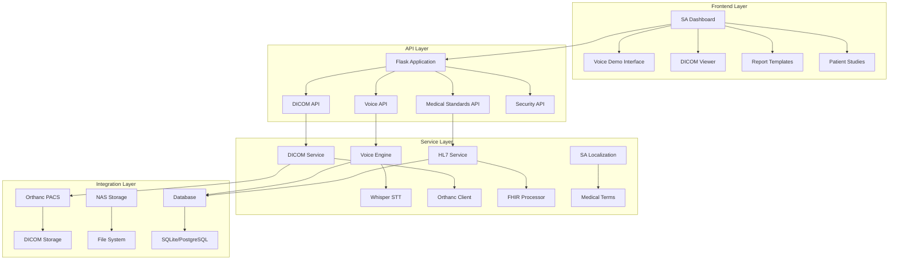

# Medical Reporting Module Complete Fix Design

## Overview

This design document outlines a comprehensive solution to fix all critical issues in the medical reporting module, transforming it into a professional, DICOM/HL7 compliant system optimized for South African medical professionals. The design addresses frontend issues, backend stability, integration protocols, and user experience problems identified through extensive testing and user feedback.

## Architecture

### System Architecture Overview



### Technology Stack

- **Frontend**: HTML5, CSS3 (SA-themed), JavaScript (ES6+), WebSocket for real-time updates
- **Backend**: Flask 2.3+, SQLAlchemy, Flask-SocketIO
- **Voice Processing**: OpenAI Whisper (offline), Web Audio API
- **Medical Standards**: pydicom, python-hl7, FHIR libraries
- **Integration**: Orthanc REST API, NAS file system access
- **Security**: SSL/TLS, JWT tokens, audit logging
- **Database**: SQLite (development), PostgreSQL (production)

## Components and Interfaces

### 1. Frontend Components

#### SA Dashboard Component
- **Purpose**: Professional, culturally-appropriate main interface
- **Key Features**:
  - South African flag color scheme and medical iconography
  - Responsive grid layout optimized for medical workstations
  - Real-time system status indicators
  - Quick action cards with proper navigation
  - Professional typography and spacing

#### Voice Demo Interface Component
- **Purpose**: Complete voice dictation system with microphone access
- **Key Features**:
  - HTTPS-enabled microphone access with permission handling
  - Real-time audio visualization and feedback
  - Offline Whisper integration with SA English optimization
  - Medical terminology correction and learning
  - Template integration with voice commands
  - Professional medical interface design

#### DICOM Viewer Component
- **Purpose**: Medical image viewing with DICOM compliance
- **Key Features**:
  - Multi-viewport layouts (1x1, 2x2, 3x3, custom)
  - Window/level adjustment, zoom, pan, rotate
  - DICOM metadata display and validation
  - Measurement tools and annotations
  - Series navigation and study comparison
  - Print and export functionality

### 2. Backend Services

#### Voice Engine Service
```python
class VoiceEngineService:
    def __init__(self):
        self.whisper_model = WhisperModelManager()
        self.sa_localization = SALocalizationManager()
        self.medical_processor = MedicalTermProcessor()
    
    def process_audio(self, audio_data: bytes) -> Dict[str, Any]:
        # Process audio with Whisper
        # Apply SA medical terminology corrections
        # Return structured transcription result
        pass
    
    def handle_voice_command(self, command: str) -> Dict[str, Any]:
        # Process voice commands for navigation and templates
        pass
```

#### DICOM Integration Service
```python
class DicomIntegrationService:
    def __init__(self):
        self.orthanc_client = OrthancClient()
        self.nas_manager = NASStorageManager()
        self.dicom_validator = DicomValidator()
    
    def retrieve_study(self, study_id: str) -> Dict[str, Any]:
        # DICOM C-FIND and C-GET operations
        # Validate DICOM compliance
        # Cache locally for offline access
        pass
    
    def store_report(self, report_data: Dict) -> str:
        # Create DICOM SR (Structured Report)
        # Store in Orthanc and NAS
        # Maintain audit trail
        pass
```

#### Medical Standards Service
```python
class MedicalStandardsService:
    def __init__(self):
        self.hl7_processor = HL7Processor()
        self.fhir_client = FHIRClient()
        self.sa_standards = SAMedicalStandards()
    
    def validate_patient_data(self, patient_data: Dict) -> bool:
        # Validate against HL7 FHIR standards
        # Check SA ID number format
        # Verify medical aid scheme data
        pass
    
    def format_report(self, report_data: Dict) -> str:
        # Format according to SA medical standards
        # Include required metadata and signatures
        pass
```

### 3. Integration Interfaces

#### Orthanc PACS Interface
```python
class OrthancClient:
    def __init__(self, base_url: str, username: str, password: str):
        self.base_url = base_url
        self.auth = (username, password)
        self.session = requests.Session()
    
    def find_studies(self, query: Dict) -> List[Dict]:
        # DICOM C-FIND operation
        # Return study metadata
        pass
    
    def get_study_images(self, study_id: str) -> List[bytes]:
        # DICOM C-GET operation
        # Return image data
        pass
```

#### NAS Storage Interface
```python
class NASStorageManager:
    def __init__(self, mount_point: str):
        self.mount_point = Path(mount_point)
        self.ensure_connection()
    
    def store_file(self, file_data: bytes, path: str) -> bool:
        # Store file with proper permissions
        # Maintain directory structure
        pass
    
    def retrieve_file(self, path: str) -> bytes:
        # Retrieve file with error handling
        pass
```

## Data Models

### Patient Data Model (HL7 FHIR Compliant)
```python
class Patient(db.Model):
    id = db.Column(db.String(50), primary_key=True)
    sa_id_number = db.Column(db.String(13), unique=True)  # SA ID format
    first_name = db.Column(db.String(100), nullable=False)
    last_name = db.Column(db.String(100), nullable=False)
    date_of_birth = db.Column(db.Date, nullable=False)
    medical_aid_scheme = db.Column(db.String(100))
    medical_aid_number = db.Column(db.String(50))
    created_at = db.Column(db.DateTime, default=datetime.utcnow)
    updated_at = db.Column(db.DateTime, default=datetime.utcnow, onupdate=datetime.utcnow)
```

### DICOM Study Model
```python
class DicomStudy(db.Model):
    study_instance_uid = db.Column(db.String(100), primary_key=True)
    patient_id = db.Column(db.String(50), db.ForeignKey('patient.id'))
    study_date = db.Column(db.Date, nullable=False)
    study_time = db.Column(db.Time)
    modality = db.Column(db.String(10), nullable=False)
    study_description = db.Column(db.Text)
    orthanc_id = db.Column(db.String(100))
    nas_path = db.Column(db.String(500))
    cached_locally = db.Column(db.Boolean, default=False)
```

### Medical Report Model
```python
class MedicalReport(db.Model):
    id = db.Column(db.String(50), primary_key=True)
    study_id = db.Column(db.String(100), db.ForeignKey('dicom_study.study_instance_uid'))
    doctor_id = db.Column(db.String(50), nullable=False)
    template_id = db.Column(db.String(50))
    report_text = db.Column(db.Text, nullable=False)
    voice_recording_path = db.Column(db.String(500))
    status = db.Column(db.String(20), default='draft')  # draft, review, final
    created_at = db.Column(db.DateTime, default=datetime.utcnow)
    finalized_at = db.Column(db.DateTime)
    digital_signature = db.Column(db.Text)
```

### SA Medical Template Model
```python
class SAMedicalTemplate(db.Model):
    id = db.Column(db.String(50), primary_key=True)
    name = db.Column(db.String(200), nullable=False)
    specialty = db.Column(db.String(100))  # Radiology, Pathology, etc.
    procedure_type = db.Column(db.String(100))
    template_content = db.Column(db.Text, nullable=False)
    voice_commands = db.Column(db.JSON)  # Voice activation commands
    sa_specific_fields = db.Column(db.JSON)  # SA medical practice fields
    created_by = db.Column(db.String(50))
    is_active = db.Column(db.Boolean, default=True)
```

## Error Handling

### Frontend Error Handling
```javascript
class SAErrorHandler {
    static handleAPIError(error, context) {
        const errorMessage = this.getSAFriendlyMessage(error);
        this.showNotification(errorMessage, 'error');
        this.logError(error, context);
    }
    
    static getSAFriendlyMessage(error) {
        const saErrorMessages = {
            'MICROPHONE_ACCESS_DENIED': 'Mikrofoontoegang geweier. Gaan na HTTPS vir stemfunksies.',
            'ORTHANC_CONNECTION_FAILED': 'PACS-verbinding gefaal. Kontak IT-ondersteuning.',
            'VOICE_PROCESSING_ERROR': 'Stemverwerking gefaal. Probeer weer of gebruik toetsenbord.',
            'DICOM_LOAD_ERROR': 'Mediese beeld kon nie laai nie. Gaan na netwerkverbinding.',
        };
        return saErrorMessages[error.code] || error.message;
    }
}
```

### Backend Error Handling
```python
class MedicalErrorHandler:
    @staticmethod
    def handle_dicom_error(error: Exception, context: str) -> Dict[str, Any]:
        logger.error(f"DICOM error in {context}: {str(error)}")
        
        if isinstance(error, DicomConnectionError):
            return {
                'error': 'ORTHANC_CONNECTION_FAILED',
                'message': 'Unable to connect to PACS server',
                'recovery_action': 'check_network_and_retry'
            }
        
        return {
            'error': 'DICOM_PROCESSING_ERROR',
            'message': str(error),
            'recovery_action': 'contact_support'
        }
```

## Testing Strategy

### Unit Testing
- **Voice Processing**: Test Whisper integration, SA terminology correction
- **DICOM Operations**: Test image loading, metadata validation, storage
- **HL7 Processing**: Test patient data validation, FHIR compliance
- **SA Localization**: Test terminology, ID validation, medical aid processing

### Integration Testing
- **Orthanc Integration**: Test DICOM C-FIND, C-GET, C-STORE operations
- **NAS Storage**: Test file operations, permissions, backup procedures
- **Voice-to-Report Workflow**: End-to-end voice dictation to final report
- **Offline/Online Sync**: Test data synchronization and conflict resolution

### User Acceptance Testing
- **SA Doctor Workflow**: Test complete reporting workflow with SA doctors
- **Interface Usability**: Test dashboard navigation and voice interface
- **Performance Testing**: Test image loading times, voice processing speed
- **Compliance Testing**: Verify DICOM/HL7 standards compliance

## Security Considerations

### Data Protection
- **Encryption**: All patient data encrypted at rest and in transit
- **Access Control**: Role-based access with SA medical practice hierarchies
- **Audit Logging**: Comprehensive audit trails for POPIA compliance
- **Data Retention**: Automated data retention policies per SA regulations

### Network Security
- **SSL/TLS**: Mandatory HTTPS for all communications
- **VPN Integration**: Support for hospital VPN requirements
- **Firewall Rules**: Specific rules for Orthanc and NAS access
- **Certificate Management**: Automated SSL certificate renewal

### Authentication & Authorization
```python
class SAMedicalAuth:
    def authenticate_doctor(self, credentials: Dict) -> Optional[Dict]:
        # Authenticate against hospital AD/LDAP
        # Validate SA medical practice number
        # Return user profile with permissions
        pass
    
    def authorize_patient_access(self, doctor_id: str, patient_id: str) -> bool:
        # Check doctor-patient relationship
        # Verify access permissions per SA medical ethics
        pass
```

## Performance Optimization

### Frontend Performance
- **Lazy Loading**: Load dashboard components on demand
- **Image Caching**: Intelligent DICOM image caching strategy
- **Bundle Optimization**: Minimize JavaScript and CSS bundles
- **Service Worker**: Offline functionality with service worker

### Backend Performance
- **Database Indexing**: Optimized indexes for medical queries
- **Connection Pooling**: Efficient database and Orthanc connections
- **Caching Strategy**: Redis caching for frequently accessed data
- **Background Processing**: Async processing for voice transcription

### Voice Processing Optimization
```python
class VoiceOptimizer:
    def __init__(self):
        self.model_cache = {}
        self.processing_queue = Queue()
    
    def optimize_whisper_model(self, model_size: str):
        # Load appropriate model size based on hardware
        # Cache models in memory for faster processing
        # Implement model quantization for speed
        pass
```

## Deployment Strategy

### Development Environment
- **Local Setup**: Docker containers for Orthanc, database
- **SSL Certificates**: Self-signed certificates for HTTPS testing
- **Mock Data**: SA-specific test patients and studies
- **Hot Reload**: Development server with auto-reload

### Production Environment
- **Container Deployment**: Docker containers with health checks
- **Load Balancing**: Nginx load balancer for high availability
- **Database**: PostgreSQL with replication for reliability
- **Monitoring**: Comprehensive monitoring with alerting

### Migration Strategy
```python
class MigrationManager:
    def migrate_existing_data(self):
        # Migrate existing reports to new format
        # Update DICOM metadata for compliance
        # Preserve audit trails during migration
        pass
    
    def validate_migration(self):
        # Verify data integrity after migration
        # Test all critical workflows
        # Generate migration report
        pass
```

This design provides a comprehensive solution that addresses all identified issues while maintaining professional medical standards and South African cultural appropriateness. The modular architecture ensures maintainability and scalability for future enhancements.