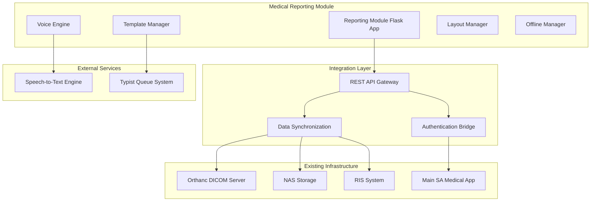

# Medical Reporting Module Design

## Overview

The Medical Reporting Module is a standalone Flask application designed to integrate seamlessly with the existing SA Medical System architecture. It provides an offline-first, doctor-centric reporting environment with advanced voice dictation, customizable layouts, and intelligent template management. The module leverages the consolidated backbone architecture pattern established in the main SA Medical System while maintaining its independence as a specialized reporting tool.

## Architecture

### High-Level Architecture



### Application Structure

```
medical-reporting-module/
├── app.py                          # Main Flask application (consolidated backbone)
├── config/
│   ├── settings.py                 # Configuration management
│   ├── offline_config.py           # Offline-first settings
│   └── integration_config.py       # Integration endpoints
├── core/
│   ├── reporting_engine.py         # Core reporting functionality
│   ├── voice_engine.py             # Voice dictation and STT
│   ├── template_manager.py         # Template management system
│   ├── layout_manager.py           # Customizable UI layouts
│   └── offline_manager.py          # Offline synchronization
├── integrations/
│   ├── orthanc_client.py           # Orthanc DICOM integration
│   ├── nas_client.py               # NAS storage integration
│   ├── ris_client.py               # RIS system integration
│   └── auth_bridge.py              # Authentication with main system
├── api/
│   ├── reporting_api.py            # Reporting REST endpoints
│   ├── voice_api.py                # Voice dictation endpoints
│   ├── template_api.py             # Template management endpoints
│   ├── layout_api.py               # Layout customization endpoints
│   └── sync_api.py                 # Synchronization endpoints
├── frontend/
│   ├── static/                     # Static assets (CSS, JS, images)
│   ├── templates/                  # Jinja2 templates
│   └── components/                 # Reusable UI components
├── models/
│   ├── report.py                   # Report data models
│   ├── template.py                 # Template data models
│   ├── layout.py                   # Layout configuration models
│   └── voice_session.py            # Voice session models
├── services/
│   ├── stt_service.py              # Speech-to-text service
│   ├── typist_service.py           # Typist queue management
│   ├── image_service.py            # DICOM image handling
│   └── cache_service.py            # Offline caching service
└── utils/
    ├── dicom_utils.py              # DICOM processing utilities
    ├── voice_utils.py              # Voice processing utilities
    └── sync_utils.py               # Synchronization utilities
```

## Components and Interfaces

### 1. Reporting Engine Core

**Purpose**: Central orchestrator for all reporting functionality

**Key Classes**:
```python
class ReportingEngine:
    def __init__(self):
        self.voice_engine = VoiceEngine()
        self.template_manager = TemplateManager()
        self.layout_manager = LayoutManager()
        self.offline_manager = OfflineManager()
    
    def create_report(self, study_id: str, template_id: str = None) -> Report
    def load_study_images(self, study_id: str) -> List[DicomImage]
    def save_report_draft(self, report: Report) -> bool
    def submit_for_typing(self, report: Report) -> bool
```

**Interfaces**:
- REST API endpoints for report CRUD operations
- WebSocket connections for real-time voice transcription
- Integration APIs for external system communication

### 2. Voice Engine

**Purpose**: Handles speech-to-text conversion and voice command processing with South African English optimization

**Key Classes**:
```python
class VoiceEngine:
    def __init__(self):
        self.whisper_manager = WhisperModelManager()
        self.stt_service = STTService()
        self.command_processor = VoiceCommandProcessor()
        self.learning_engine = STTLearningEngine()
        self.sa_terminology = SAMedicalTerminology()
    
    def start_dictation_session(self, user_id: str) -> VoiceSession
    def process_voice_command(self, audio_data: bytes) -> VoiceCommand
    def transcribe_audio(self, audio_data: bytes) -> str
    def learn_from_corrections(self, original: str, corrected: str) -> None
    def initialize_whisper_model(self, model_size: str = "base") -> bool

class WhisperModelManager:
    def __init__(self):
        self.model_path = "models/whisper"
        self.available_models = ["tiny", "base", "small", "medium", "large"]
    
    def check_model_exists(self, model_size: str) -> bool
    def download_model(self, model_size: str) -> bool
    def get_model_size_for_system(self) -> str
    def validate_model_integrity(self, model_size: str) -> bool

class SAMedicalTerminology:
    def __init__(self):
        self.sa_medical_terms = self.load_sa_medical_dictionary()
        self.pronunciation_map = self.load_sa_pronunciation_map()
    
    def enhance_transcription(self, text: str) -> str
    def correct_sa_medical_terms(self, text: str) -> str
```

**Features**:
- Automatic Whisper model download and management
- Real-time speech-to-text optimized for South African English accents
- Voice command recognition for template selection
- Adaptive learning from typist corrections
- South African medical terminology enhancement
- Intelligent model size selection based on system resources

### 3. Template Manager

**Purpose**: Manages report templates and voice-activated template selection

**Key Classes**:
```python
class TemplateManager:
    def __init__(self):
        self.template_repository = TemplateRepository()
        self.voice_commands = VoiceCommandRegistry()
    
    def load_template(self, template_id: str) -> ReportTemplate
    def create_custom_template(self, base_template: str, modifications: dict) -> ReportTemplate
    def register_voice_command(self, command: str, template_id: str) -> None
    def search_templates(self, procedure_type: str, specialty: str) -> List[ReportTemplate]
```

**Template Categories**:
- General radiology templates
- Specialty-specific templates (cardiology, orthopedics, etc.)
- South African specific templates (TB screening, trauma assessment)
- User-customized templates

### 4. Layout Manager

**Purpose**: Provides highly customizable screen layouts for different examination types

**Key Classes**:
```python
class LayoutManager:
    def __init__(self):
        self.layout_repository = LayoutRepository()
        self.viewport_manager = ViewportManager()
    
    def load_layout(self, layout_id: str, user_id: str) -> ScreenLayout
    def save_custom_layout(self, layout: ScreenLayout, user_id: str) -> str
    def apply_layout_preset(self, examination_type: str) -> ScreenLayout
    def support_multi_monitor(self, monitor_config: dict) -> ScreenLayout
```

**Layout Features**:
- Drag-and-drop viewport arrangement
- Resizable panels and windows
- Multi-monitor support
- Examination-type specific presets
- User-specific layout persistence

### 5. Offline Manager

**Purpose**: Ensures full functionality without network connectivity

**Key Classes**:
```python
class OfflineManager:
    def __init__(self):
        self.cache_service = CacheService()
        self.sync_queue = SynchronizationQueue()
        self.conflict_resolver = ConflictResolver()
    
    def cache_study_data(self, study_id: str) -> bool
    def queue_offline_action(self, action: OfflineAction) -> None
    def sync_when_online(self) -> SyncResult
    def resolve_conflicts(self, conflicts: List[DataConflict]) -> Resolution
```

**Offline Capabilities**:
- Local caching of DICOM images and metadata
- Offline report creation and editing
- Queue-based synchronization when connectivity returns
- Conflict resolution for concurrent edits

## Data Models

### Report Model
```python
class Report:
    id: str
    study_id: str
    patient_id: str
    doctor_id: str
    template_id: str
    content: dict
    voice_recording_path: str
    status: ReportStatus  # DRAFT, TYPING, REVIEW, FINAL
    created_at: datetime
    updated_at: datetime
    offline_changes: List[OfflineChange]
```

### Template Model
```python
class ReportTemplate:
    id: str
    name: str
    category: str
    specialty: str
    voice_commands: List[str]
    sections: List[TemplateSection]
    default_values: dict
    is_custom: bool
    created_by: str
```

### Layout Model
```python
class ScreenLayout:
    id: str
    name: str
    user_id: str
    examination_type: str
    viewport_config: dict
    panel_arrangement: dict
    monitor_setup: dict
    is_default: bool
```

### Voice Session Model
```python
class VoiceSession:
    id: str
    user_id: str
    report_id: str
    audio_segments: List[AudioSegment]
    transcription: str
    commands_executed: List[VoiceCommand]
    start_time: datetime
    end_time: datetime
```

## Error Handling

### Offline Error Handling
- Graceful degradation when network is unavailable
- Local error logging with sync when online
- User notification of offline status
- Automatic retry mechanisms for failed operations

### Integration Error Handling
- Fallback to cached data when external systems are unavailable
- Circuit breaker pattern for external API calls
- Comprehensive error logging and monitoring
- User-friendly error messages with suggested actions

### Voice Processing Error Handling
- Audio quality validation before processing
- Fallback to keyboard input when voice fails
- STT confidence scoring with manual review triggers
- Background noise filtering and audio enhancement

## Testing Strategy

### Unit Testing
- Individual component testing with mocks
- Voice engine testing with sample audio files
- Template manager testing with various template types
- Offline manager testing with simulated network conditions

### Integration Testing
- End-to-end workflow testing
- External system integration testing
- Voice-to-text accuracy testing with medical terminology
- Multi-user concurrent access testing

### Performance Testing
- Image loading and rendering performance
- Voice transcription latency testing
- Offline synchronization performance
- Multi-monitor layout rendering performance

### User Acceptance Testing
- Doctor workflow testing with real scenarios
- Typist workflow testing and feedback collection
- Voice command accuracy testing with South African accents
- Template customization and usage testing

## Security Considerations

### SSL/HTTPS Configuration
- Automatic SSL certificate generation for development environments
- Support for Let's Encrypt certificates in production
- Self-signed certificate creation with clear setup instructions
- HTTPS enforcement for microphone access compliance
- Flexible HTTP/HTTPS mode switching for development vs production

### Authentication and Authorization
- Integration with existing SA Medical System authentication
- Role-based access control for different user types
- Session management with automatic timeout
- Two-factor authentication support

### Data Protection
- POPIA compliance for patient data handling (South African privacy law)
- Encryption of voice recordings and transcriptions
- Secure transmission of data between systems
- Audit logging of all user actions

### Voice Data Security
- Encrypted storage of voice recordings
- Secure transmission to typist systems
- Automatic deletion of voice data after processing
- User consent management for voice data usage

## Performance Optimization

### Image Handling
- Progressive image loading for large studies
- Image caching with intelligent prefetching
- Optimized image rendering for different viewport sizes
- Background image processing for smooth user experience

### Voice Processing
- Real-time audio streaming for immediate feedback
- Optimized STT processing with chunked audio
- Background voice model training and updates
- Efficient audio compression for storage and transmission

### Offline Performance
- Intelligent caching strategies for frequently accessed data
- Background synchronization to minimize user wait times
- Optimized local database queries
- Efficient conflict resolution algorithms

## South African Localization

### UI/UX Localization
```python
class SALocalizationManager:
    def __init__(self):
        self.sa_medical_terms = self.load_sa_medical_dictionary()
        self.sa_workflows = self.load_sa_healthcare_workflows()
        self.sa_templates = self.load_sa_report_templates()
    
    def localize_interface(self, user_preferences: dict) -> dict
    def get_sa_medical_templates(self, specialty: str) -> List[Template]
    def format_sa_patient_id(self, id_number: str) -> str
    def validate_sa_medical_aid(self, scheme: str, number: str) -> bool
```

### South African Medical Features
- Support for South African ID number validation and formatting
- Integration with South African medical aid schemes
- Templates for common South African medical procedures (TB screening, trauma assessment)
- South African English medical terminology and abbreviations
- Compliance with South African healthcare reporting standards

### Whisper Model Management
```python
class WhisperSetupManager:
    def __init__(self):
        self.model_directory = "models/whisper"
        self.download_urls = {
            "tiny": "https://openaipublic.azureedge.net/main/whisper/models/...",
            "base": "https://openaipublic.azureedge.net/main/whisper/models/...",
            "small": "https://openaipublic.azureedge.net/main/whisper/models/..."
        }
    
    def setup_whisper_environment(self) -> bool
    def download_model_with_progress(self, model_size: str) -> bool
    def verify_model_integrity(self, model_path: str) -> bool
    def get_optimal_model_size(self, system_specs: dict) -> str
```

### SSL Certificate Management
```python
class SSLManager:
    def __init__(self):
        self.cert_directory = "ssl_certificates"
        self.development_mode = os.getenv("FLASK_ENV") == "development"
    
    def setup_ssl_certificates(self) -> bool
    def generate_self_signed_cert(self) -> bool
    def configure_lets_encrypt(self, domain: str) -> bool
    def validate_ssl_setup(self) -> bool
```

## Deployment Architecture

### Standalone Deployment
- Independent Flask application on dedicated server with SSL/HTTPS support
- Separate database for reporting-specific data
- Integration endpoints for communication with main system
- Load balancing for high availability
- Automatic Whisper model download and setup

### Integration Points
- Authentication bridge to main SA Medical System
- REST API connections to Orthanc DICOM server
- File system integration with NAS storage
- Database synchronization with RIS system
- SSL certificate management for secure microphone access

### Scalability Considerations
- Horizontal scaling for multiple reporting stations
- Database sharding for large report volumes
- CDN integration for image delivery
- Microservice architecture for individual components
- Distributed Whisper model caching for multiple instances