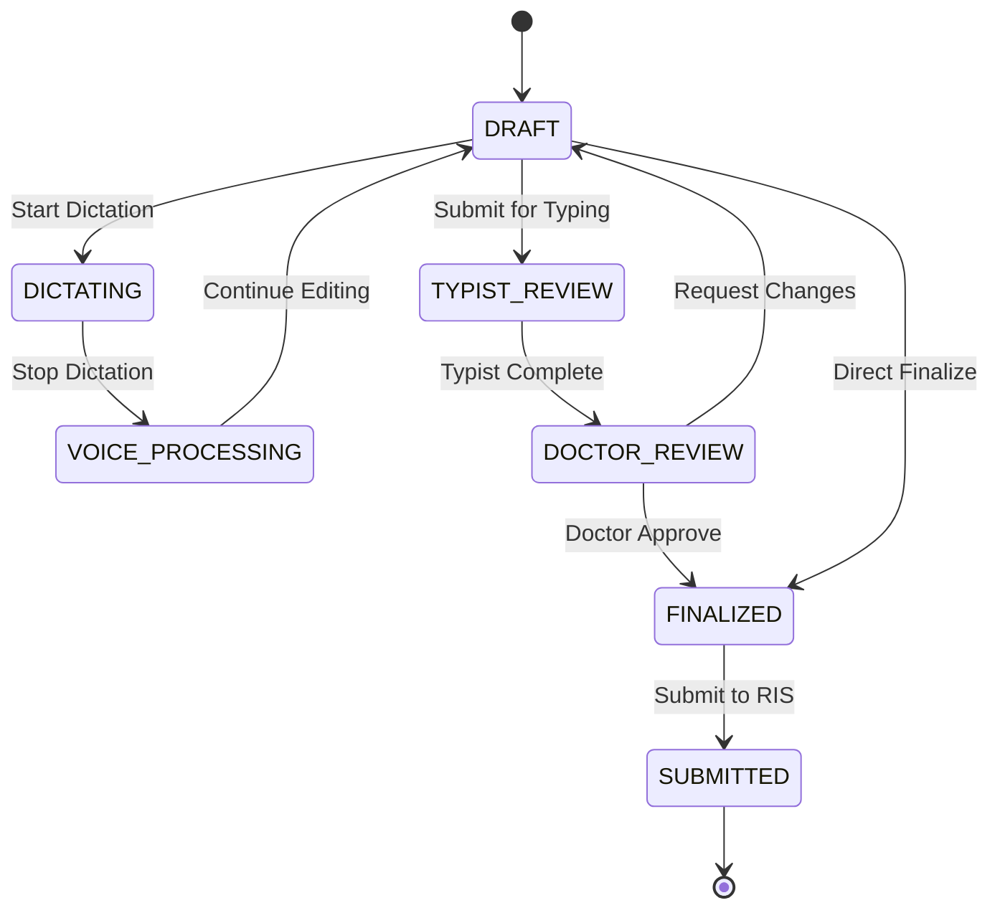

# Reporting Engine - Medical Reporting Module

## Overview

The Reporting Engine is the central orchestrator for all reporting functionality in the Medical Reporting Module. It provides comprehensive workflow management, voice integration, offline-first capabilities, and seamless integration with South African medical infrastructure.

## Features

### 🔄 Complete Workflow Management
- **Session-based Reporting**: Each report has a dedicated session with state tracking
- **Workflow States**: Draft → Dictating → Voice Processing → Typist Review → Doctor Review → Finalized → Submitted
- **Auto-save**: Configurable auto-save intervals (30s, 1min, 2min, 5min)
- **Event Tracking**: Complete audit trail of all workflow events

### 🎤 Voice Integration
- **Seamless Voice Dictation**: Integrated with offline-first voice engine
- **Voice Commands**: Template loading, navigation, system control
- **Real-time Transcription**: Live speech-to-text with medical terminology
- **Learning System**: Adapts to user corrections and improves over time

### 📋 Template Management
- **Dynamic Templates**: Load and apply templates via voice or UI
- **South African Context**: TB screening, occupational diseases, trauma
- **Voice-activated**: "Load chest x-ray template", "Use TB screening template"
- **Customizable**: User-specific template modifications

### 👩‍💻 Typist Workflow
- **Assignment System**: Automatic assignment to available typists
- **Quality Control**: Typist corrections feed back to learning system
- **Queue Management**: Priority-based assignment and workload balancing
- **Feedback Loop**: Continuous improvement of STT accuracy

### 🔌 Offline-First Architecture
- **Local Storage**: All reports saved locally first
- **Background Sync**: Automatic synchronization when online
- **Conflict Resolution**: Intelligent handling of concurrent edits
- **Cached Images**: DICOM images cached for offline viewing

## Architecture

### Core Components

```
ReportingEngine
├── VoiceEngine (Speech-to-text & commands)
├── TemplateManager (Template loading & management)
├── LayoutManager (UI layout customization)
├── OfflineManager (Offline storage & sync)
├── TypistService (Typist workflow management)
└── Integration Clients
    ├── OrthancClient (DICOM server)
    ├── NASClient (File storage)
    └── RISClient (Radiology information system)
```

### Workflow States



## API Usage

### Creating a Report Session

```python
from core.reporting_engine import reporting_engine
from models.report import ReportType

# Create new report session
session = reporting_engine.create_report(
    user_id="doctor123",
    study_id="study456", 
    template_id="chest_xray_template",
    report_type=ReportType.DIAGNOSTIC
)

print(f"Session ID: {session.session_id}")
print(f"Report ID: {session.report_id}")
```

### Voice Dictation Workflow

```python
# Start voice dictation
success = reporting_engine.start_dictation(session.session_id)

# Voice engine will handle:
# - Real-time speech-to-text
# - Voice command recognition
# - Medical terminology correction
# - South African accent processing

# Stop dictation
success = reporting_engine.stop_dictation(session.session_id)
```

### Saving and Managing Drafts

```python
# Save draft content
draft_content = {
    "clinical_info": "Patient presents with chest pain",
    "findings": "Bilateral lung fields are clear",
    "impression": "Normal chest radiograph"
}

success = reporting_engine.save_report_draft(session.session_id, draft_content)
```

### Workflow Progression

```python
# Submit for typist review
success = reporting_engine.submit_for_typing(session.session_id)

# Finalize report
success = reporting_engine.finalize_report(session.session_id)

# Submit to RIS
success = reporting_engine.submit_report(session.session_id)
```

### Session Management

```python
# Get session information
session_info = reporting_engine.get_session_info(session.session_id)
print(f"Current state: {session_info['workflow_state']}")

# Get all active sessions
active_sessions = reporting_engine.get_active_sessions()

# End session
success = reporting_engine.end_session(session.session_id)
```

## REST API Endpoints

### Session Management
```http
POST /api/reporting/                    # Create new report
GET  /api/reporting/session/{id}        # Get session info
POST /api/reporting/session/{id}/end    # End session
GET  /api/reporting/sessions/active     # Get active sessions
```

### Study and Images
```http
GET /api/reporting/session/{id}/images  # Load study images
```

### Voice Dictation
```http
POST /api/reporting/session/{id}/dictation/start  # Start dictation
POST /api/reporting/session/{id}/dictation/stop   # Stop dictation
```

### Workflow Management
```http
POST /api/reporting/session/{id}/draft           # Save draft
POST /api/reporting/session/{id}/submit-typing   # Submit for typing
POST /api/reporting/session/{id}/finalize        # Finalize report
POST /api/reporting/session/{id}/submit          # Submit to RIS
```

### Monitoring and Analytics
```http
GET /api/reporting/workflow/events      # Get workflow events
GET /api/reporting/engine/stats         # Get engine statistics
```

## Configuration

### Auto-Save Settings
```python
from core.reporting_engine import AutoSaveInterval

# Configure auto-save
config = {
    'auto_save_enabled': True,
    'auto_save_interval': AutoSaveInterval.EVERY_MINUTE,
    'max_session_duration': timedelta(hours=8),
    'session_timeout': timedelta(minutes=30)
}
```

### Voice Integration
```python
config = {
    'enable_voice_integration': True,
    'enable_typist_workflow': True,
    'enable_offline_mode': True
}
```

## Workflow Events

The reporting engine tracks all workflow events for audit and analytics:

```python
# Get workflow events
events = reporting_engine.get_workflow_events(
    session_id="session123",
    limit=50
)

# Event types include:
# - report_created
# - dictation_started/stopped
# - draft_saved
# - template_applied
# - submitted_for_typing
# - report_finalized
# - report_submitted
# - session_ended
```

## Integration with Voice Engine

### Voice Commands
The reporting engine responds to voice commands:

- **Template Loading**: "Load chest x-ray template"
- **Navigation**: "Go to findings section"
- **System Control**: "Save report", "Submit report"
- **Quick Fill**: "Normal chest study", "No acute findings"

### Real-time Transcription
```python
# Voice transcription is automatically handled
# Text appears in real-time as user speaks
# Medical terminology is corrected automatically
# South African accents are processed correctly
```

## Typist Integration

### Assignment Creation
```python
# When report is submitted for typing
assignment_id = typist_service.create_assignment(
    report_id=session.report_id,
    doctor_id=session.user_id,
    voice_recording_path="/recordings/session123.wav",
    stt_draft="Preliminary STT transcription",
    priority=Priority.NORMAL
)
```

### Feedback Loop
```python
# Typist corrections improve STT accuracy
typist_service.submit_feedback(
    assignment_id=assignment_id,
    corrected_text="Corrected transcription",
    error_categories=["medical_terminology", "pronunciation"]
)
```

## Offline Capabilities

### Local Storage
- All reports saved locally first
- DICOM images cached for offline viewing
- Voice recordings stored locally
- Templates cached for offline use

### Synchronization
```python
# Automatic sync when online
# Queued actions are processed in background
# Conflict resolution for concurrent edits
# Progress tracking for sync operations
```

## South African Medical Context

### Specialized Templates
- **TB Screening**: Tuberculosis detection and reporting
- **Occupational Diseases**: Silicosis, pneumoconiosis, asbestosis
- **Trauma**: High-priority trauma reporting (GSW, MVA)
- **HIV-related**: PCP, Kaposi's sarcoma, opportunistic infections

### Medical Terminology
- South African English pronunciation patterns
- Local medical terminology and abbreviations
- Mining-related occupational health terms
- High-prevalence disease patterns (TB, HIV)

## Performance Optimization

### Caching Strategy
- Intelligent image prefetching
- Template caching for quick access
- Voice model caching for offline use
- Database query optimization

### Background Processing
- Auto-save in background thread
- Voice transcription processing
- Image loading and caching
- Synchronization queue processing

## Monitoring and Analytics

### Engine Statistics
```python
stats = reporting_engine.get_engine_stats()
# Returns:
# - active_sessions: Number of active sessions
# - total_workflow_events: Total events tracked
# - auto_save_running: Auto-save thread status
# - voice_integration_enabled: Voice features status
# - typist_workflow_enabled: Typist features status
# - offline_mode_enabled: Offline capabilities status
```

### Session Analytics
- Session duration tracking
- Workflow state transitions
- Voice usage statistics
- Template usage patterns
- Error rates and resolution

## Error Handling

### Graceful Degradation
- Offline mode when network unavailable
- Voice fallback to keyboard input
- Template fallback to basic structure
- Image fallback to cached versions

### Error Recovery
- Automatic retry for failed operations
- Session state recovery after crashes
- Data integrity checks and repair
- User notification of issues

## Security and Compliance

### Data Protection
- POPIA compliance for patient data
- Encrypted voice recordings
- Secure data transmission
- Audit trail for all actions

### Access Control
- Session-based access control
- User permission verification
- Role-based feature access
- Secure API endpoints

## Testing

### Unit Tests
```bash
# Run simplified tests (no database required)
python test_reporting_simple.py

# Run comprehensive tests (requires full setup)
python test_reporting_engine.py
```

### Test Coverage
- ✅ Workflow state management
- ✅ Voice integration
- ✅ Template management
- ✅ Typist workflow
- ✅ Offline capabilities
- ✅ Session management
- ✅ Event tracking

## Deployment

### Requirements
- Python 3.8+
- Flask web framework
- SQLAlchemy for data models
- Voice processing dependencies
- Integration client libraries

### Configuration
```python
# Environment-specific settings
REPORTING_CONFIG = {
    'DATABASE_URL': 'sqlite:///medical_reports.db',
    'VOICE_ENGINE_ENABLED': True,
    'OFFLINE_MODE_ENABLED': True,
    'AUTO_SAVE_INTERVAL': 60,  # seconds
    'MAX_SESSION_DURATION': 28800,  # 8 hours
}
```

### Health Checks
```http
GET /api/reporting/engine/stats  # Engine health status
GET /api/reporting/sessions/active  # Active session count
```

## Future Enhancements

### Planned Features
- **Multi-language Support**: Afrikaans, Zulu, Xhosa voice recognition
- **AI Assistance**: Automated finding suggestions
- **Advanced Analytics**: Reporting patterns and insights
- **Mobile Integration**: Smartphone and tablet support
- **Cloud Sync**: Optional cloud-based synchronization

### Integration Opportunities
- **PACS Integration**: Direct DICOM metadata extraction
- **EMR Integration**: Patient history and context
- **Quality Metrics**: Automated quality scoring
- **Peer Review**: Collaborative reporting features

## Support

### Documentation
- API Reference: Complete endpoint documentation
- User Guide: Step-by-step reporting workflows
- Admin Guide: System configuration and monitoring

### Troubleshooting
- Session recovery procedures
- Voice engine troubleshooting
- Offline sync issue resolution
- Performance optimization tips

---

**Note**: This reporting engine is specifically designed for South African medical professionals and includes workflows, terminology, and disease patterns common in the South African healthcare context.