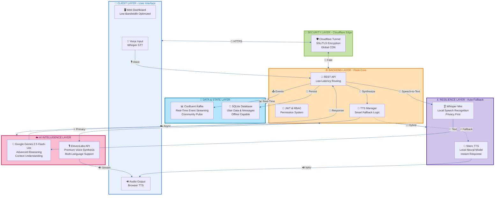
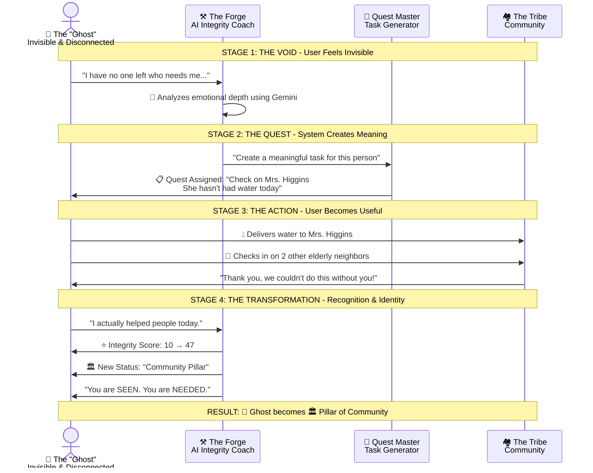
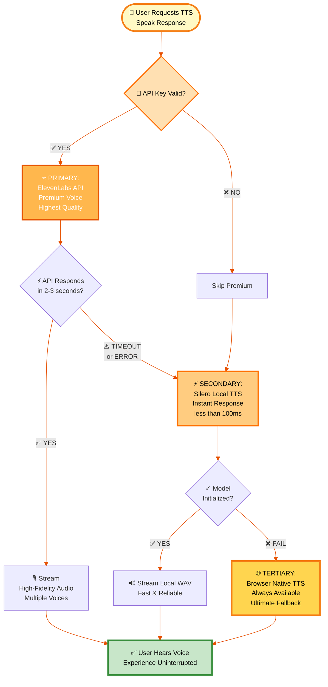

# 🛡️ SDOH Chat: Gift of the Givers (GOTG) Project

> **AI Partner Catalyst Hackathon Submission**  
> *Integrating Google Cloud Vertex AI, ElevenLabs, Confluent, and Datadog.*

This module is a critical component of the **Gift of the Givers** advanced ecosystem, integrating with **RIS (Radiology Information Systems)**, **PACS**, and **Medical Dictation** to address the **Social Determinants of Health (SDOH)**.

---

## 🌑 The Problem: The Void

Close your eyes and imagine the moment you stop being a human being.

Imagine you are standing in the middle of the street where you grew up. You are screaming for help—your lungs are burning—but the people who used to know your name look right through you. Not with hate... but with nothing. You have become a ghost in your own home. Even the police, the ones paid to see you, walk past as if you are a shadow on the wall. This is **Ostracization**. It is the realization that the world has deleted you while you are still breathing.

> *[Visual: A shot of a clinical, white-tiled floor. A single plastic bowl of water. A pair of hands trembling.]*

Imagine you are lying in a bed. You need to bathe. You need to wipe yourself. You have the dignity of a grown man, but you are trapped in the body of an infant. This is **Frail Care**. But here is the horror: Your mother is gone. Your brother is gone. Your wife was not lucky enough to survive the accident. There is no one left who loves you enough to touch you. You are waiting for a stranger in a uniform to perform the most intimate acts of your life for a paycheck. You aren't a person anymore; you are a 'task' on a clipboard.

We spend billions on healthcare. We build world-class PACS and RIS to scan the heart and mend the bone. But once your Inner Circle is taken—once the few souls you lived for are in the ground—your heart doesn't need a doctor. It needs a reason to beat.

When you have no one to live for, and no one who needs you to stay... death stops being a tragedy. It starts to feel like a blessing.

**This is the 'Why' that medicine cannot fix. This is the crisis we ignore while we brag about our algorithms. We are keeping bodies alive in a world that has already buried their souls. We are losing our loved ones—not to disease, but to the Void.**

---

## 🕯️ The Solution: Rebuilding the Tether

But hope is not a clinical outcome. It is a biological force.

Think of the sound of your wife laughing at your wedding. Think of the look in your son’s eyes—that mix of terror and absolute trust—as you teach him to swim. That physical jolt in your chest when you hear the words: *"Mama, I love you."* These are not just 'moments.' They are the internal fuel that makes the human spirit unkillable.

In healthcare, we call it 'impossible' when a patient survives a trauma they shouldn't have. We call it a 'miracle' when an old man defies his charts. But it isn't a miracle. It’s the **Why**.

Imagine if your whole community needed you—even for something as simple as water. Imagine being part of a mission so much bigger than your own struggle that your life becomes a necessity for others. When you are a pillar, you cannot afford to fall. And that is when you become immortal.

It sounds complex to engineer 'meaning.' But when you embrace our deepest, most beautiful human flaws—our need to be seen, our need to be useful—the architecture becomes clear.

We created a simple, low-bandwidth gateway, powered by a complex orchestration of AI agents. We don't use technology to replace the tribe; we use it to rebuild the tether.

**We have built a digital forge where redundancy is burned away and reliability is proven. Where a 'ghost' can earn their way back into the circle of the seen. Where we don't just mend the limb... we ignite the heart.**

---

## ⚡ Technical Architecture & Stack

Our solution leverages the **Google Cloud Partner Ecosystem** to create a resilient, voice-first interface for the most vulnerable.

### 🧠 The Brain: Google Cloud Vertex AI (Gemini 2.5 Flash-Lite)
The core intelligence of the system. **Gemini 2.5 Flash-Lite** powers our **Agent Forge** and **Quest Master**, analyzing user inputs for emotional context, generating meaningful "Quests" (community tasks), and maintaining the integrity of the social graph.
*   **Why 2.5 Flash-Lite?** It offers the perfect balance of speed and reasoning for real-time chat, ensuring low latency even on slower connections.
*   **Local Fallback:** If the cloud is unreachable or quotas are hit, the system seamlessly switches to a local **Ollama (Gemma 2B)** instance, ensuring the "Forge" never goes silent.

### � The Ears: Whisper Mini (Local STT)
To ensure privacy and functionality in low-bandwidth environments, we use **OpenAI's Whisper Mini** model running locally on the edge.
- **Privacy-First**: Voice data is transcribed locally; audio files are not sent to the cloud unless necessary.
- **Offline Capable**: Transcription works even when internet connectivity is spotty.

### �🗣️ The Voice: ElevenLabs + Hybrid Fallback
To serve the illiterate and the elderly, the interface is voice-first.
- **Primary**: **ElevenLabs API** provides hyper-realistic, empathetic voices (Rachel, Emergency, Medical) that build trust.
- **Resilience Layer**: A custom **Hybrid TTS Engine** that automatically falls back to local neural models (**Silero TTS**) or browser-native synthesis if the internet connection degrades or API quotas are hit. This ensures the "voice" of the community never goes silent.

### 🌊 The Nervous System: Confluent (Kafka)
Real-time event streaming handles the pulse of the community. Every "Quest" completed, every "Help Signal" sent is streamed via **Confluent Cloud**, allowing for immediate reaction and analysis without locking data in silos.

### 👁️ The Eyes: Datadog
End-to-end observability monitors the health of our agents. We track:
- **AI Latency**: Ensuring Gemini and ElevenLabs respond in real-time.
- **Community Health**: Custom metrics tracking "Integrity Scores" and "Quest Completion Rates".
- **System Vitals**: Error rates on the Flask backend and Cloudflare tunnels.

---

## 🎮 Gamification: The Forge & Integrity XP

We gamify the healing process using "The Forge," an AI persona that acts as a mentor.
*   **Integrity XP:** Users earn Experience Points (XP) for demonstrating vulnerability, insight, and resilience in their conversations.
*   **Insights Profile:** A dedicated UI tracks the user's "Level" and stores a history of profound insights extracted from their conversations.
*   **Visual Feedback:** Users see their XP grow in real-time, reinforcing positive mental health habits.

---

## 📊 System Diagrams

### 1. High-Level Architecture

```mermaid
%%{init: {'theme': 'default', 'themeVariables': { 'primaryColor': '#4285F4', 'primaryBorderColor': '#2C5AA0', 'primaryTextColor': '#fff', 'lineColor': '#2C5AA0', 'secondaryColor': '#34A853', 'tertiaryColor': '#EA4335', 'fontSize': '16px', 'fontFamily': 'arial'}}}%%
graph TD
    subgraph Client["📱 CLIENT LAYER - User Interface"]
        UI["🖥️ Web Dashboard<br/>Low-Bandwidth Optimized"]
        Mic["🎤 Voice Input<br/>Whisper STT"]
        Speaker["🔊 Audio Output<br/>Browser TTS"]
    end

    subgraph Security["🔐 SECURITY LAYER - Cloudflare Edge"]
        CF["🛡️ Cloudflare Tunnel<br/>SSL/TLS Encryption<br/>Global CDN"]
    end

    subgraph Backend["⚙️ BACKEND LAYER - Flask Core"]
        API["📡 REST API<br/>Low-Latency Routing"]
        Auth["🔑 JWT & RBAC<br/>Permission System"]
        Proxy["🔄 TTS Manager<br/>Smart Fallback Logic"]
    end

    subgraph AI_Cloud["☁️ AI INTELLIGENCE LAYER"]
        Gemini["🧠 Google Gemini 2.5 Flash-Lite<br/>Advanced Reasoning<br/>Context Understanding"]
        Eleven["🎙️ ElevenLabs API<br/>Premium Voice Synthesis<br/>Multi-Language Support"]
    end

    subgraph Data_Stream["🌊 DATA & STATE LAYER"]
        Kafka["📊 Confluent Kafka<br/>Real-Time Event Streaming<br/>Community Pulse"]
        SQLite["💾 SQLite Database<br/>User Data & Messages<br/>Offline Capable"]
    end

    subgraph Fallback["⚓ RESILIENCE LAYER - Auto-Fallback"]
        Silero["🎵 Silero TTS<br/>Local Neural Model<br/>Instant Response"]
        Whisper["👂 Whisper Mini<br/>Local Speech Recognition<br/>Privacy First"]
    end

    Mic -->|🎙️ Voice| API
    API -->|🔄 Speech-to-Text| Whisper
    Whisper -->|📝 Text| Gemini
    Gemini -->|💬 Response| API
    
    API -->|📄 Synthesize| Proxy
    Proxy -->|⭐ Primary| Eleven
    Proxy -.->|⚡ Fallback| Silero
    
    Eleven -->|🔊 Stream| Speaker
    Silero -->|🔊 WAV| Speaker
    
    API -->|📤 Events| Kafka
    API -->|💾 Persist| SQLite
    
    Client <-->|🔐 HTTPS| CF
    CF <-->|🚀 Fast| Backend
    Backend <-->|☁️ Async| AI_Cloud
    Backend -->|🔌 Hybrid| Fallback
    Backend <-->|📊 Real-Time| Data_Stream

    style Client fill:#E8F0FE,stroke:#4285F4,stroke-width:3px,color:#1a73e8
    style Security fill:#C5E1A5,stroke:#7CB342,stroke-width:3px,color:#33691E
    style Backend fill:#FFE0B2,stroke:#F57C00,stroke-width:3px,color:#E65100
    style AI_Cloud fill:#F8BBD0,stroke:#C2185B,stroke-width:3px,color:#880E4F
    style Data_Stream fill:#B3E5FC,stroke:#0277BD,stroke-width:3px,color:#01579B
    style Fallback fill:#D1C4E9,stroke:#512DA8,stroke-width:3px,color:#311B92
```

### 2. The "Ghost to Pillar" Transformation Journey

```mermaid
%%{init: {'theme': 'default', 'themeVariables': { 'primaryColor': '#9C27B0', 'primaryBorderColor': '#6A1B9A', 'primaryTextColor': '#fff', 'lineColor': '#6A1B9A', 'fontSize': '14px'}}}%%
sequenceDiagram
    actor Ghost as 👻 The "Ghost"<br/>Invisible & Disconnected
    participant Forge as ⚒️ The Forge<br/>AI Integrity Coach
    participant Quest as 📜 Quest Master<br/>Task Generator
    participant Tribe as 🏘️ The Tribe<br/>Community

    Note over Ghost,Tribe: STAGE 1: THE VOID - User Feels Invisible
    Ghost->>Forge: "I have no one left who needs me..."
    Forge->>Forge: 🧠 Analyzes emotional depth using Gemini
    
    Note over Ghost,Tribe: STAGE 2: THE QUEST - System Creates Meaning
    Forge->>Quest: "Create a meaningful task for this person"
    Quest->>Ghost: 📋 Quest Assigned: "Check on Mrs. Higgins<br/>She hasn't had water today"
    
    Note over Ghost,Tribe: STAGE 3: THE ACTION - User Becomes Useful
    Ghost->>Tribe: 💧 Delivers water to Mrs. Higgins
    Ghost->>Tribe: 🤝 Checks in on 2 other elderly neighbors
    Tribe->>Ghost: "Thank you, we couldn't do this without you!"
    
    Note over Ghost,Tribe: STAGE 4: THE TRANSFORMATION - Recognition & Identity
    Ghost->>Forge: "I actually helped people today."
    Forge->>Ghost: ⭐ Integrity Score: 10 → 47
    Forge->>Ghost: 🏛️ New Status: "Community Pillar"
    Forge->>Ghost: "You are SEEN. You are NEEDED."
    
    Note over Ghost,Tribe: RESULT: 👻 Ghost becomes 🏛️ Pillar of Community
```

### 3. Resilience & Fallback Logic - "Always Speaking"

```mermaid
%%{init: {'theme': 'default', 'themeVariables': { 'primaryColor': '#FF6F00', 'primaryBorderColor': '#E65100', 'primaryTextColor': '#fff', 'lineColor': '#E65100', 'fontSize': '13px'}}}%%
flowchart TD
    Start(["🎯 User Requests TTS<br/>Speak Response"]) 
    
    Start --> CheckAPI{🔑 API Key Valid?}
    
    CheckAPI -->|✅ YES| CallEleven["⭐ PRIMARY:<br/>ElevenLabs API<br/>Premium Voice<br/>Highest Quality"]
    CheckAPI -->|❌ NO| SkipEleven["Skip Premium"]
    
    CallEleven --> ElevenSuccess{⚡ API Responds<br/>in 2-3 seconds?}
    ElevenSuccess -->|✅ YES| StreamAudio["🎙️ Stream<br/>High-Fidelity Audio<br/>Multiple Voices"]
    ElevenSuccess -->|⚠️ TIMEOUT<br/>or ERROR| LocalTTS
    
    SkipEleven --> LocalTTS["⚡ SECONDARY:<br/>Silero Local TTS<br/>Instant Response<br/>less than 100ms"]
    
    LocalTTS --> LocalSuccess{✓ Model<br/>Initialized?}
    LocalSuccess -->|✅ YES| StreamWav["🔊 Stream Local WAV<br/>Fast & Reliable"]
    LocalSuccess -->|❌ FAIL| BrowserTTS["🌐 TERTIARY:<br/>Browser Native TTS<br/>Always Available<br/>Ultimate Fallback"]
    
    StreamAudio --> Success["✅ User Hears Voice<br/>Experience Uninterrupted"]
    StreamWav --> Success
    BrowserTTS --> Success
    
    style Start fill:#FFF9C4,stroke:#F57F17,stroke-width:3px,color:#000
    style CheckAPI fill:#FFE0B2,stroke:#FF6F00,stroke-width:2px,color:#000
    style CallEleven fill:#FFB74D,stroke:#E65100,stroke-width:3px,color:#fff
    style LocalTTS fill:#FFCC80,stroke:#FF6F00,stroke-width:3px,color:#000
    style BrowserTTS fill:#FFD54F,stroke:#F57F17,stroke-width:3px,color:#000
    style Success fill:#C8E6C9,stroke:#388E3C,stroke-width:3px,color:#000
```

---

## 🚀 Getting Started

1.  **Clone the Repository**
2.  **Install Dependencies**: `pip install -r requirements.txt`
3.  **Configure Keys**: Update `config.ini` with your Google Cloud, ElevenLabs, and Confluent keys.
4.  **Run the Server**: `python run.py`
5.  **Access**: Open `https://localhost:5000` (or your Cloudflare URL).

---

*Built with ❤️ for the AI Partner Catalyst Hackathon.*
