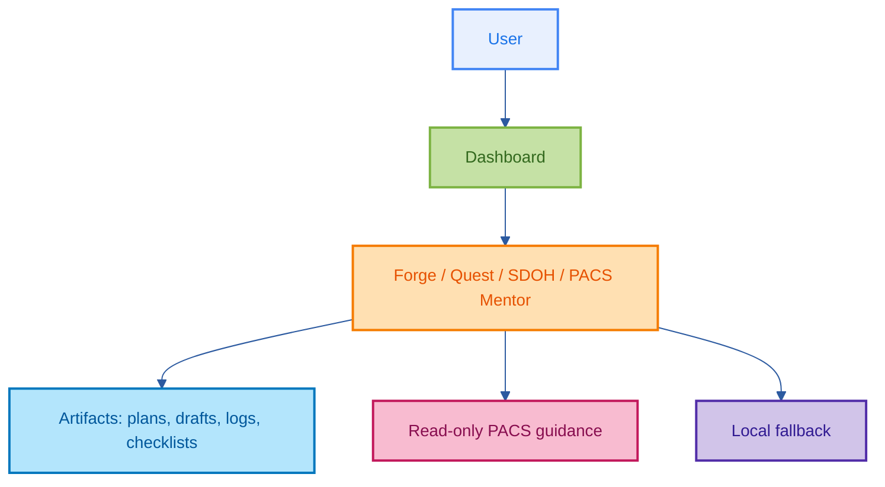

# 🛡️ SDOH Chat: Gift of the Givers (GOTG) Project

> **SIIM Hackathon 2026 Submission**
> *A Flask + browser dashboard for SDOH support, PACS continuity, and agent-driven recovery workflows.*

**TL;DR:** A four-agent Flask dashboard that turns SDOH needs and PACS downtime into concrete plans, exports, and read-only recovery steps with local-first fallback.

This is not a chatbot. It is a continuity system that turns clinical and operational context into actionable recovery workflows and structured outputs.

Designed for degraded, low-bandwidth, and partially offline environments.

This system exists for the moments when follow-up care breaks down and radiology teams are under pressure.

## What This Is

A four-agent continuity system for SDOH follow-up, PACS recovery, and operator-mediated incident triage.

It turns care disruptions into exportable artifacts, recovery logs, and clear next steps.

## Judge Summary

- Problem: Missed follow-ups and PACS downtime create continuity failures.
- Solution: A local-first operational workflow system that produces actionable recovery artifacts.
- Differentiator: Read-only PACS continuity guidance and SDOH coordination in one workflow platform.

## Why Now

- Healthcare systems are operating under staffing and infrastructure strain.
- Radiology downtime and missed follow-ups create cascading continuity failures.
- Most AI healthcare demos focus on conversation instead of operational recovery.
- This project focuses on actionable continuity under real-world constraints.

## Why This Is Different

| Typical AI Assistant | This System |
|---|---|
| Generic conversation | Operational continuity workflows |
| Cloud-dependent | Local-first fallback |
| Chat-only output | Exportable artifacts |
| Passive responses | Structured escalation guidance |
| No downtime awareness | PACS continuity workflows |

## Demo Screenshots

| Dashboard | SDOH Agent |
|---|---|
|  |  |
|  |  |

## Demo GIF

## Artifact Moment

| Input | System Output | Real File |
|---|---|---|
| No ride, imaging follow-up next week | Draft caregiver message + reminder plan | `CAREGIVER_MESSAGE.txt` + `REMINDER.ics` |
| Worklist stalled, studies not reaching archive | Read-only downtime triage + escalation guidance | `INFRASTRUCTURE_RECOVERY_LOG.md` |

## Example System Output (Real Demo Flow)

### SDOH Agent Output

- Appointment: PET scan in 7 days
- Barrier: No transport
- Action:
    - Draft SMS to caregiver
    - Created `.ics` reminder
    - Added fallback clinic contact

### PACS Mentor Output

- Status: Imaging ingest delayed
- Check:
    - DICOM listener reachable: YES
    - Archive queue backlog: HIGH
- Recommendation:
    - Escalate the RIS queue check in read-only mode
    - Preserve incoming studies locally

The PACS Mentor is intentionally designed for read-only guidance, operator verification, and escalation support rather than autonomous infrastructure modification.

The system is designed to support operator decision-making and continuity workflows rather than replace clinical or infrastructure teams.

### Generated Artifacts

- `REMINDER.ics`
- `CAREGIVER_MESSAGE.txt`
- `INFRASTRUCTURE_RECOVERY_LOG.md`

---

## Why This Matters (in SIIM terms)

- Reduces missed follow-ups in SDOH workflows.
- Reduces imaging downtime in PACS continuity workflows.
- Converts unstructured clinical context into actionable artifacts.
- Works in degraded or offline environments.

## Target Operational Outcomes

- Faster PACS downtime triage
- Reduced missed imaging follow-ups
- Reduced caregiver coordination friction
- Improved continuity in low-bandwidth environments
- Reduced downtime escalation confusion
- Auditable recovery documentation

### What A Judge Can Demo In 30 Seconds

Open one SDOH prompt and one PACS prompt to see the system produce a plan, a draft, and a recovery log instead of a generic chat reply.

- **SDOH prompt:** I have a follow-up imaging appointment next week, no ride, and I need help drafting a message for my family and a reminder plan.
- **PACS prompt:** The worklist is stalled, studies are not reaching archive, and I need a read-only recovery checklist plus the safest next escalation step.

### Operational Continuity Modules

Forge and Quest exist to improve adherence, follow-through, and user engagement during stressful or fragmented care workflows.

- **Forge**: adherence reinforcement and continuity coaching.
- **Quest**: structured engagement workflows for follow-through support.
- **SDOH**: continuity support, extraction, and local export helpers.
- **PACS Mentor**: break-glass radiology recovery with OCR verification and passive infrastructure awareness.

## Safety Boundaries

- PACS Mentor is read-only and does not autonomously modify infrastructure
- Escalation guidance is operator-mediated
- Local fallback preserves continuity during degraded connectivity
- The system supports workflows and coordination rather than replacing clinicians or IT staff

## 🚀 Getting Started

1.  **Clone the Repository**
2.  **Install Dependencies**: `pip install -r requirements.txt`
3.  **Configure Keys**: Update `config.ini` with your Google Cloud, ElevenLabs, and Confluent keys.
4.  **Run the Server**: `python run.py`
5.  **Access**: Open `https://localhost:5000` (or your Cloudflare URL).

### How to Verify This Locally

1.  Sanity-check the low-level dependencies before you test the app:
    `python -c "import pytesseract; from scapy.all import ARP, sniff; print('Tesseract OCR:', pytesseract.get_tesseract_version()); print('Scapy:', ARP.__name__, sniff.__name__)"`
2.  Start the app with `python run.py`.
3.  Open the SDOH chat and send: `I have a follow-up imaging appointment next week, no ride, and I need help drafting a message for my family and a reminder plan.`
4.  Confirm the response includes a concrete plan, not just a generic chat reply.
5.  Open the PACS mentor and send: `The worklist is stalled, studies are not reaching archive, and I need a read-only recovery checklist plus the safest next escalation step.`
6.  Confirm the response stays in read-only recovery mode and references verification or escalation rather than making live changes.

## Architecture

```mermaid
%%{init: {'theme': 'default', 'themeVariables': { 'primaryColor': '#4285F4', 'primaryBorderColor': '#2C5AA0', 'primaryTextColor': '#fff', 'lineColor': '#2C5AA0', 'fontSize': '14px', 'fontFamily': 'arial'}}}%%
graph TD
    User["User"] --> UI["Dashboard"]
    UI --> Agent["Forge / Quest / SDOH / PACS Mentor"]
    Agent --> Outputs["Artifacts: plans, drafts, logs, checklists"]
    Agent --> Safety["Read-only PACS guidance"]
    Agent --> Fallback["Local fallback"]

    style User fill:#E8F0FE,stroke:#4285F4,stroke-width:2px,color:#1a73e8
    style UI fill:#C5E1A5,stroke:#7CB342,stroke-width:2px,color:#33691E
    style Agent fill:#FFE0B2,stroke:#F57C00,stroke-width:2px,color:#E65100
    style Outputs fill:#B3E5FC,stroke:#0277BD,stroke-width:2px,color:#01579B
    style Safety fill:#F8BBD0,stroke:#C2185B,stroke-width:2px,color:#880E4F
    style Fallback fill:#D1C4E9,stroke:#512DA8,stroke-width:2px,color:#311B92
```

The full architecture diagram is in [docs/architecture.md](docs/architecture.md).
