# 🏥 Ubuntu Patient Care 🇿🇦
**Your code can fight injustice. Your passion can heal a nation.**

---

## 🚨 **FOR CLINICIANS & HEALTHCARE WORKERS - START HERE!** 

**👨‍⚕️ Are you a doctor, nurse, or healthcare worker who needs to use this system?**  
**👉 [Click here for SIMPLE, NON-TECHNICAL instructions](#-for-clinicians--simple-setup)**

**Not technical? No problem!**  
1. ⬇️ [Download the system](#step-1-download-one-time-only)
2. ▶️ [Start with ONE click](#step-2-start-the-system-one-click)
3. 🌐 [Open in your browser](#step-3-access-the-system)

---

## 📊 How The System Works (Visual Guide)

### 🏥 System Overview

```mermaid
graph TB
    A[👨‍⚕️ Healthcare Worker] -->|Opens browser| B[🖥️ Ubuntu Patient Care]
    B --> C[📝 Medical Reporting<br/>Voice Dictation]
    B --> D[🖼️ Medical Imaging<br/>X-rays, CT, MRI]
    B --> E[💰 Billing System<br/>Medical Aid Claims]
    
    C -->|Saves reports| F[(💾 Secure Database)]
    D -->|Stores images| G[(📁 NAS Storage)]
    E -->|Processes claims| H[🏛️ Medical Aid Schemes]
    
    style A fill:#e1f5ff
    style B fill:#ffe1e1
    style C fill:#e1ffe1
    style D fill:#ffe1ff
    style E fill:#fff9e1
```



### 🔄 Daily Workflow (Step-by-Step)


### 📱 Access From Anywhere


---

## 👨‍⚕️ FOR CLINICIANS — SIMPLE SETUP

### ⚡ What You Need (3 things):
1. ✅ A Windows computer (most clinics have this)
2. ✅ Python installed (we'll show you how)
3. ✅ 10 minutes of your time

---

### 📥 Step 1: Download (One-time only)

**Option A: If you have Git (recommended)**
1. Open PowerShell (search "PowerShell" in Windows start menu)
2. Copy and paste this command:
   ```powershell
   cd $HOME\Desktop; git clone https://github.com/Jobeer1/Ubuntu-Patient-Care.git; cd Ubuntu-Patient-Care
   ```
3. Press Enter and wait for download to complete

**Option B: Direct Download (easier)**
1. Click this link: https://github.com/Jobeer1/Ubuntu-Patient-Care/archive/refs/heads/main.zip
2. Extract the ZIP file to your Desktop
3. Rename the folder to `Ubuntu-Patient-Care`

---

### 🐍 Install Python (One-time only)

**Is Python already installed?** Check by opening PowerShell and typing:
```powershell
py --version
```

**If you see "Python 3.x.x" → You're good! Skip to Step 2.**

**If you see an error:**
1. Download Python from: https://www.python.org/downloads/
2. Run the installer
3. ✅ **IMPORTANT:** Check the box "Add Python to PATH"
4. Click "Install Now"
5. Restart your computer

---

### ▶️ Step 2: Start the System (ONE CLICK!)

**This is the easiest way:**

1. Go to: `Desktop\Ubuntu-Patient-Care\Orthanc\`
2. Find the file: `START_SYSTEM.ps1`
3. **Right-click** on it
4. Select **"Run with PowerShell"**
5. Wait for this message: **✅ SYSTEM READY!**

**That's it!** The system is now running.

**⚠️ Keep the PowerShell window open while you work!**

---

### 🌐 Step 3: Access the System

**On the same computer:**
- **Medical Reporting (Voice Dictation):** https://127.0.0.1:5443
- **Medical Imaging (View X-rays/CT):** http://127.0.0.1:5000

**From your phone or tablet:**
1. You need a secure link (HTTPS) for microphone to work
2. Open a NEW PowerShell window
3. Run this command:
   ```powershell
   & "$env:USERPROFILE\cloudflared\cloudflared.exe" tunnel --url "https://127.0.0.1:5443" --no-tls-verify
   ```
4. Look for a link like: `https://something.trycloudflare.com`
5. Open that link on any device!

**Install Cloudflare Tunnel (one-time setup):**
```powershell
$dest = "$env:USERPROFILE\cloudflared"
New-Item -ItemType Directory -Path $dest -Force
Invoke-WebRequest -Uri 'https://github.com/cloudflare/cloudflared/releases/latest/download/cloudflared-windows-amd64.exe' -OutFile "$dest\cloudflared.exe"
```

---

### 🛑 How to Stop the System

**When you're done for the day:**
1. Go to the PowerShell window
2. Press `Ctrl + C` on your keyboard
3. Wait for it to say "✅ All services stopped"
4. Close the window

**DON'T just close the window!** Always press `Ctrl + C` first.

---

### ⚠️ Common Problems & Quick Fixes

| Problem | Solution |
|---------|----------|
| **"Python not found"** | Install Python from python.org (check "Add to PATH") |
| **"Port already in use"** | Close PowerShell, wait 10 seconds, try again |
| **Microphone doesn't work** | Use the Cloudflare Tunnel link (see above) |
| **Can't access from phone** | Use Cloudflare Tunnel to get HTTPS link |
| **System won't start** | Make sure Python is installed and in PATH |

---

### 📞 Need Help?

**Don't struggle alone!** We're here to help:
- 📧 Email: support@ubuntu-patient-care.com
- 💬 GitHub: https://github.com/Jobeer1/Ubuntu-Patient-Care/issues
- 📱 Take a screenshot and send it to us!

**We want this to work for you! ❤️**

---

## 🏆 HACKATHON DEMO - Try It Now!

**🎯 For Judges & Evaluators:** Get started in 30 seconds!

[](https://gitpod.io/#https://github.com/Jobeer1/Ubuntu-Patient-Care)

### 🚀 Quick Setup Instructions:
1. **Click the Gitpod button above** - No local setup required!
2. **Wait for automatic setup** - Dependencies install automatically
3. **Run the setup script:** `bash setup_hackathon.sh`
4. **Start the system:** `python Orthanc/medical-reporting-module/core/app_factory.py`

### 🔧 Local Setup (Alternative):
```bash
git clone https://github.com/Jobeer1/Ubuntu-Patient-Care.git
cd Ubuntu-Patient-Care
bash setup_hackathon.sh
```

### 📝 Demo Features:
- ✅ **DICOM Medical Imaging Viewer** - Full PACS functionality
- ✅ **Voice-to-Text Medical Reporting** - AI-powered transcription
- ✅ **South African Medical Billing** - Complete RIS integration
- ✅ **Offline-First Design** - Works without internet
- ✅ **Open Source & Free** - No licensing fees

---

## 💔 The Problem. Our Problem.

This is a story you know. A doctor needs an ultrasound to save a life, but the machine is "end of life." A multi-billion dollar company, like Philips, tells you, "Sorry, we can't offer any services or parts. Please buy a new machine."

The frustration is real. Perfectly good machines are being decommissioned and shipped overseas as e-waste, deemed worthless by corporate mandates. Meanwhile, millions of our loved ones suffer because they cannot afford the systems that are built for profit, not for our people.

This is not a business problem. It's a moral failure of a system that serves those who can pay, while leaving millions of our loved ones behind.

---

## ✊ Our Mission. Our Rebellion.

We are a small team of passionate developers who said: **ENOUGH!**

We are building a free, open-source medical system to end this injustice. Ubuntu Patient Care is a comprehensive Radiology Information System (RIS), Picture Archiving and Communication System (PACS), and medical billing platform.

We are building it to be accessible, maintainable, and ethically sound.

🌍 **Built for the people:** Full offline functionality for clinics in remote areas with unreliable internet access.

💪 **Built on strength:** Powered by the open-source excellence of Orthanc, Whisper, and openEMR.

🇿🇦 **Built for our reality:** A system deeply tailored for the unique needs of South Africa 🇿🇦, where over 52 million people are excluded from quality healthcare.

---

## ❤️ Why Your Contribution Matters

We are a small team of four from different countries, united by this purpose. We are fighting a massive, powerful enemy, but we have a secret weapon: **You**.

This isn't just about building software. It's about writing code that's helping to save lives of our loved ones.

**You can be a builder**: Your skills in Python, JavaScript, C++, or PHP can help us refine and expand a system that is saving lives.

**You can be a pioneer**: The world of open-source ML models is evolving. Your ideas can help us integrate the next generation of AI to make our system smarter, faster, and more life-saving.

**You can be a storyteller**: Your voice can amplify our mission. Share your experiences, your challenges, and your victories. Help us spread the word about Ubuntu Patient Care and the impact it's having.

**You can be part of a community**: Whether you're an unemployed person who wants to help with documentation or a seasoned developer, your contribution is invaluable. The more people who contribute, the more we all own this fight. It's the IKEA effect of compassion.

This isn't a one-time effort. It is a continuous rebellion. It is a long, hard fight. But every line of code you contribute, every bug you fix, and every idea you share is a stand against a system that puts profit over our loved ones.

---

## 🌟 World-First Features That Set Us Apart

### 🇿🇦 **Uniquely South African**
- **🗣️ 11 Official Languages Support** - Full interface in English, Afrikaans, isiZulu, isiXhosa, Sesotho, Setswana, Sepedi, Tshivenda, Xitsonga, siSwati, and isiNdebele
- **🤝 Ubuntu Care Philosophy** - Community-centered healthcare with family involvement
- **🌿 Traditional Medicine Integration** - World's first digital bridge between traditional African healing and modern medicine
- **⚡ Load Shedding Awareness** - Intelligent power management during South Africa's unique power challenges
- **🏛️ Complete Medical Aid Integration** - Direct integration with ALL major SA medical schemes

### 🚀 **Revolutionary Technology**
- **🔄 Offline-First Architecture** - Full functionality without internet connection
- **🏥 Advanced Patient Management** - Customized OpenEMR for South African workflows
- **📸 Enterprise DICOM Storage** - Orthanc PACS with intelligent NAS integration
- **👁️ Professional Medical Imaging** - Browser-based DICOM viewer with AI enhancement
- **💰 Intelligent Billing System** - Automated claims processing for all SA medical aids
- **🔒 POPI Act Compliance** - Military-grade data protection and privacy compliance
- **📊 Real-Time Dashboard** - Live patient status and workflow management
- **🤖 AI-Powered Insights** - Predictive analytics for better patient outcomes

---

---

## � Project Organization

After our recent restructuring, the project is now organized into **logical medical modules** for easy navigation:

```
Ubuntu-Patient-Care/
├── 1-RIS-Module/                    # Radiological Information System (OpenEMR Integration)
│   └── RADIOLOGICAL_INFORMATION_SYSTEM.md
├── 2-Medical-Billing/               # Medical Billing & Claims Processing
│   └── MEDICAL_BILLING_COMPLETE.md
├── 3-Dictation-Reporting/           # Voice-to-Text Medical Reporting (Whisper AI)
│   └── REPORTING_MODULE_*.md files
├── 4-PACS-Module/                   # Medical Imaging (Orthanc + GPU Acceleration)
│   └── PATIENT_ACCESS_*.md files
├── docs/                            # Comprehensive documentation
│   ├── DOCUMENTATION_NAVIGATION.md  # Start here for navigation
│   ├── FOLDER_STRUCTURE_SUMMARY.md  # Detailed folder layout
│   ├── OAuth/                       # Authentication & OAuth setup
│   ├── OneDrive/                    # Cloud storage integration
│   ├── MCP/                         # MCP Server documentation
│   └── ... (90+ technical docs)
├── scripts/                         # Automation scripts
│   ├── setup_hackathon.sh
│   ├── START_SYSTEM.ps1
│   └── ... (17 total scripts)
├── tests/                           # Unit and integration tests
├── logs/                            # Application logs
└── data/                            # Database files & configuration
```

**🎯 Start Here:** [Documentation Navigation Guide](docs/DOCUMENTATION_NAVIGATION.md)

---

## 🏥 Module Guide for Doctors & Clinicians

### **Module 1: RIS (Radiological Information System)**
**Location:** `1-RIS-Module/`

**What it does:**
- Patient registration and scheduling
- Radiology workflow management
- Integration with OpenEMR electronic health records
- Multi-user support with role-based access

**For Doctors:**
1. Access at: https://127.0.0.1:5000 (on-site)
2. Register a new patient and create a radiology appointment
3. Assign imaging studies to technicians
4. Review technician notes before final report

---

### **Module 2: PACS (Picture Archiving & Communication System)**
**Location:** `4-PACS-Module/`

**What it does:**
- Store and retrieve medical images (X-rays, CT, MRI, ultrasound)
- AI-powered image analysis and enhancement
- GPU-accelerated processing for cardiac analysis

**🚀 GPU-Accelerated Features (69% Performance Improvement):**

#### **� Cardiac Calcium Scoring (Agatston Method)**
- Analyzes coronary artery calcium from CT images
- Calculates cardiovascular disease risk using MESA percentiles
- Helps stratify patients for preventive treatment

**How to use:**
1. Upload a cardiac CT image (DICOM format)
2. Click "Calcium Score Analysis"
3. System calculates Agatston score and risk category
4. Review risk stratification (1-4) for patient management

**Clinical Output:**
```
Agatston Score: 245 (Category 2)
Risk Percentile: 65th (MESA)
Recommendation: Consider statin therapy
```

#### **🫀 Perfusion Parameter Analysis**
- Calculates cerebral blood flow (CBF), blood volume (CBV), mean transit time (MTT)
- Identifies areas of reduced perfusion in stroke assessment
- Maps perfusion maps for clinical review

**How to use:**
1. Upload cerebral perfusion CT study (4D series)
2. Click "Perfusion Parameters"
3. System processes dynamic contrast enhancement
4. Review perfusion maps color-coded by value

**Clinical Output:**
- **CBF (mL/100g/min)**: Color-coded map (blue=low, red=high)
- **CBV (mL/100g)**: Blood volume distribution
- **MTT (seconds)**: Transit time delays
- **TTP**: Time to peak enhancement

#### **🧠 Stroke Detection (AI-Enhanced)**
- Identifies acute ischemic stroke markers
- Compares perfusion-weighted and diffusion-weighted imaging
- Recommends imaging follow-up protocol

**How to use:**
1. Upload acute stroke imaging (PWI/DWI series)
2. Click "Stroke Analysis"
3. Review AI-flagged areas of concern
4. Make clinical decisions on thrombolytic therapy

**For Doctors:**
1. Access PACS at: http://127.0.0.1:5000
2. Search patient by ID or date
3. View all studies in timeline
4. Use AI analysis tools for cardiac/cerebral cases
5. Annotate images and generate reports

---

### **Module 3: Dictation & Reporting**
**Location:** `3-Dictation-Reporting/`

**What it does:**
- AI-powered speech-to-text (OpenAI Whisper)
- Real-time transcription in medical terminology
- Automatic report generation
- Voice commands for hands-free operation

**For Doctors:**
1. Open: https://127.0.0.1:5443
2. Click "New Dictation" or use voice button 🎤
3. Speak your medical findings
4. System converts speech to text in real-time
5. Edit and finalize the report
6. Digital signature and save to patient record

**Example Workflow:**
```
Doctor speaks: "Patient presents with 3cm liver lesion in segment 8, 
               heterogeneous enhancement, concerning for HCC"

System transcribes: "Patient presents with 3 centimeter liver lesion 
                    in segment 8, heterogeneous enhancement, concerning 
                    for hepatocellular carcinoma"

Doctor reviews, signs, and sends to medical record ✅
```

**Languages Supported:** English, Afrikaans, isiZulu, and 9 more official SA languages

---

### **Module 4: Medical Billing**
**Location:** `2-Medical-Billing/`

**What it does:**
- Automated claims generation for all SA medical aids
- Procedure coding (ICD-10, CPT)
- Direct submission to medical schemes
- Claims tracking and reconciliation

**For Billing Department:**
1. Select completed patient study/procedure
2. Verify diagnosis and procedure codes
3. Click "Submit Claim"
4. System formats and submits to medical aid
5. Track reimbursement status in dashboard

**Supported Medical Aids:**
- Discovery Health
- Momentum Health
- Bonitas
- Medshield
- All major SA schemes

---

## 🔐 MCP Server: Single Sign-On & Access Control

### **What is the MCP Server?**

The MCP Server is the **centralized authentication & access control gateway** for the Ubuntu Patient Care system.

**In plain language:**
- Single login portal using Google or Microsoft credentials
- One account for access to all 4 medical modules
- Role-based permissions (Doctor, Technician, Administrator, Billing Officer)
- Secure LAN access control (on-site network only)
- Works completely offline after first authentication

### **How It Works**

```
┌─────────────────────────────────────────────────────────┐
│              MCP Server (Port 8080)                     │
│        SSO Gateway & Access Control Manager             │
└─────────────────────────────────────────────────────────┘
         ↑ Google OAuth          ↑ Microsoft OAuth
         │                       │
    Step 1: User logs in with Google OR Microsoft credentials
    Step 2: MCP Server validates identity and fetches credentials
    Step 3: Session token issued with role permissions
    Step 4: User granted access to authorized modules
```

### **Module Access Control (Role-Based)**

| Role | RIS | PACS | Dictation | Billing | Permissions |
|------|-----|------|-----------|---------|-------------|
| **Doctor** | ✅ View/Order | ✅ View/Analyze | ✅ Full Access | ❌ View Only | Read imaging, create reports, order studies |
| **Technician** | ✅ Manage Queue | ✅ Upload/Store | ❌ View Only | ❌ None | Schedule appointments, process imaging |
| **Radiologist** | ✅ Admin | ✅ Full Admin | ✅ Review | ✅ View | Report findings, approve studies, manage users |
| **Billing Officer** | ✅ View | ✅ View | ✅ View | ✅ Full Admin | Generate claims, track reimbursement, audits |
| **Administrator** | ✅ Full | ✅ Full | ✅ Full | ✅ Full | System configuration, user management |

### **Authentication Flow**

**First Time Setup:**
```
1. Doctor visits: http://localhost:5000/login
2. Clicks "Sign in with Google" or "Sign in with Microsoft"
3. Redirected to MCP Server (port 8080)
4. Authenticated with Google/Microsoft OAuth
5. Session token created with doctor's role
6. Redirected to PACS Dashboard
7. Can now access all authorized modules
```

**Offline Access After Login:**
```
- Credentials cached locally
- Works on LAN without internet
- Session valid for 7 days
- Auto-refreshes when online
```

### **Real-World Example: Doctor Workflow**

```
Monday 8:00 AM - Dr. Sarah logs in
  ✓ Opens browser to http://localhost:5000
  ✓ Clicks "Sign in with Microsoft"
  ✓ Uses her hospital Microsoft account
  ✓ MCP validates credentials in < 2 seconds
  ✓ Dashboard loads with access to:
    - RIS (patient orders)
    - PACS (medical imaging)
    - Dictation/Reporting (voice-to-text)
    - Billing (read-only)

During the day:
  ✓ Orders X-ray for patient → RIS
  ✓ Reviews prior CT scans → PACS (with GPU analysis)
  ✓ Dictates findings → Dictation module
  ✓ System automatically routes report to billing
  ✓ All actions logged and audited

Offline access:
  ✓ If internet goes down, Dr. Sarah can still:
    - View cached patient data
    - Create new orders (queued)
    - Continue dictating reports
  ✓ When internet returns, changes sync automatically
```

### **Security Features**

| Feature | Benefit |
|---------|---------|
| **OAuth Integration** | No passwords stored locally, enterprise-grade authentication |
| **LAN-Only Access** | Only accessible from hospital network (on-site only) |
| **Role-Based Control** | Granular permissions per user role |
| **Session Management** | 7-day offline capability, auto-sync when online |
| **Activity Logging** | All actions audited for compliance (POPI Act) |
| **Credential Caching** | Works offline without internet connectivity |

### **SSO Providers**

**Microsoft Active Directory:**
- Hospital Microsoft 365 accounts
- Enterprise credential management
- Integrates with hospital directory

**Google Workspace:**
- Gmail-based authentication
- Cloud credential management
- Easy setup for smaller clinics

### **Current Development Status**

✅ **Completed:**
- OAuth integration with Google and Microsoft
- Backend MCP server (port 8080)
- Session management and caching
- Basic role definitions
- Frontend login page

🚧 **In Development:**
- Role-based access control enforcement per module
- Offline credential caching
- Activity logging and audit trails
- User management dashboard
- Emergency access override (admin only)

📋 **Planned (Phase 2):**
- Two-factor authentication
- Biometric authentication (fingerprint/face)
- Advanced access policies (time-based, location-based)
- Integration with hospital LDAP directory
- Mobile app authentication

### **Access Control Architecture**

```mermaid
graph TB
    User["👤 Doctor/Staff"]
    Login["🔐 Login Page<br/>http://localhost:5000/login"]
    MCP["🔑 MCP Server<br/>Port 8080<br/>SSO & Auth"]
    Google["🔵 Google OAuth"]
    Microsoft["🔵 Microsoft OAuth"]
    
    RIS["📋 RIS Module<br/>Patient Management"]
    PACS["🖼️ PACS Module<br/>Medical Imaging"]
    Dict["🎤 Dictation Module<br/>Voice Reports"]
    Billing["💰 Billing Module<br/>Claims"]
    
    User -->|"1. Visit"| Login
    Login -->|"2. Redirect"| MCP
    MCP -->|"3. OAuth"| Google
    MCP -->|"3. OAuth"| Microsoft
    Google -->|"4. Authenticate"| MCP
    Microsoft -->|"4. Authenticate"| MCP
    MCP -->|"5. Grant Access<br/>Role: Doctor"| RIS
    MCP -->|"5. Grant Access"| PACS
    MCP -->|"5. Grant Access"| Dict
    MCP -->|"5. View Only"| Billing
    
    style User fill:#e1f5ff
    style Login fill:#fff3e0
    style MCP fill:#f3e5f5,stroke:#9c27b0,stroke-width:3px
    style Google fill:#e8f5e9
    style Microsoft fill:#e3f2fd
    style RIS fill:#fce4ec
    style PACS fill:#fce4ec
    style Dict fill:#fce4ec
    style Billing fill:#fce4ec
```



### **Doctor Workflow with MCP Server**


### **Role-Based Access Flow**

```mermaid
graph TD
    Login["User Authentication<br/>Google/Microsoft OAuth"]
    
    Login -->|Success| TokenGeneration["Generate Token<br/>with User Role"]
    
    TokenGeneration --> RoleCheck{Check User Role}
    
    RoleCheck -->|Doctor| DocAccess["✅ RIS: View/Order<br/>✅ PACS: View/Analyze<br/>✅ Dictation: Full<br/>❌ Billing: View Only"]
    
    RoleCheck -->|Technician| TechAccess["✅ RIS: Manage Queue<br/>✅ PACS: Upload/Store<br/>❌ Dictation: View<br/>❌ Billing: None"]
    
    RoleCheck -->|Radiologist| RadAccess["✅ RIS: Admin<br/>✅ PACS: Full Admin<br/>✅ Dictation: Review<br/>✅ Billing: View"]
    
    RoleCheck -->|Billing Officer| BillAccess["✅ RIS: View<br/>✅ PACS: View<br/>✅ Dictation: View<br/>✅ Billing: Full Admin"]
    
    RoleCheck -->|Administrator| AdminAccess["✅ All Modules: Full Admin<br/>✅ User Management<br/>✅ System Settings"]
    
    DocAccess --> Dashboard["🎯 PACS Dashboard<br/>Personalized by Role"]
    TechAccess --> Dashboard
    RadAccess --> Dashboard
    BillAccess --> Dashboard
    AdminAccess --> Dashboard
    
    style Login fill:#f3e5f5,stroke:#9c27b0,stroke-width:2px
    style TokenGeneration fill:#f3e5f5,stroke:#9c27b0,stroke-width:2px
    style RoleCheck fill:#fff3e0,stroke:#ff9800,stroke-width:2px
    style DocAccess fill:#c8e6c9
    style TechAccess fill:#c8e6c9
    style RadAccess fill:#c8e6c9
    style BillAccess fill:#c8e6c9
    style AdminAccess fill:#c8e6c9
    style Dashboard fill:#bbdefb,stroke:#2196f3,stroke-width:2px
```



### **For IT/Administrators:**

**Configuration Files:**
- `4-PACS-Module/Orthanc/mcp-server/.env` - OAuth credentials
- `.kiro/settings/mcp.json` - MCP server configuration
- `docs/MCP/` - Technical setup documentation

**Setup:**
```bash
# 1. Configure OAuth credentials
# Set GOOGLE_CLIENT_ID, MICROSOFT_CLIENT_ID in .env

# 2. Start MCP Server
cd 4-PACS-Module/Orthanc/mcp-server
python run.py

# 3. MCP Server runs on port 8080
# Login portal: http://localhost:5000/login
```

**Testing OAuth:**
1. Visit http://localhost:5000/login
2. Click "Sign in with Microsoft" or "Sign in with Google"
3. Should redirect to OAuth provider
4. After authentication, redirected to PACS dashboard
5. All modules now accessible based on role

**See:** [MCP Login Integration Guide](docs/MCP_LOGIN_INTEGRATION_GUIDE.md) for detailed setup

---

## 📖 Full Documentation

**For detailed technical documentation:**
- 📋 [Documentation Navigation](docs/DOCUMENTATION_NAVIGATION.md) - Start here for all docs
- 📊 [Folder Structure Summary](docs/FOLDER_STRUCTURE_SUMMARY.md) - Detailed layout
- 🏥 [Module-Specific Guides](1-RIS-Module/, 2-Medical-Billing/, 3-Dictation-Reporting/, 4-PACS-Module/) - Technical details per module
- 🔧 [Developer Documentation](docs/) - For contributors and developers
- 🔐 [OAuth & Security](docs/OAuth/) - Authentication setup
- ☁️ [Cloud Storage (OneDrive)](docs/OneDrive/) - Integration guide
- 🤖 [MCP Server Setup](docs/MCP/) - AI server configuration

---

## 🤝 Contributing

We welcome contributions from the global community fighting healthcare injustice!

### How to Contribute
1. 🍴 Fork the repository
2. 🌿 Create a feature branch (`git checkout -b feature/heal-the-world`)
3. 💾 Commit your changes (`git commit -m 'Add life-saving feature'`)
4. 📤 Push to branch (`git push origin feature/heal-the-world`)
5. 🔄 Open a Pull Request

---

## 📄 License

This project is licensed under the **GPL-3.0 License** - making healthcare accessible to all.

---

## 🙏 Acknowledgments

- **🏥 Orthanc Project** - DICOM server foundation
- **📋 OpenEMR** - Electronic health records system
- **🇿🇦 South African Medical Community** - Requirements and validation
- **🌍 Global Open Source Community** - Collaborative development

---

<div align="center">

**🏥 Ubuntu Patient Care - Healthcare Revolution Through Code 🏥**

*"Your code can fight injustice. Your passion can heal a nation."* 🇿🇦

[](https://github.com/Jobeer1/Ubuntu-Patient-Care)
[](https://github.com/Jobeer1/Ubuntu-Patient-Care/fork)

**🏆 Code with Kiro Hackathon 2025 - Fighting Healthcare Injustice 🏆**

</div>
