# 🏥 Ubuntu Patient Care 🇿🇦
**Your code can fight injustice. Your passion can heal a nation.**

---

## 🚨 **FOR CLINICIANS & HEALTHCARE WORKERS - START HERE!** 

**👨‍⚕️ Are you a doctor, nurse, or healthcare worker who needs to use this system?**  
**👉 [Click here for SIMPLE, NON-TECHNICAL instructions](#-for-clinicians--simple-setup)**

**Not technical? No problem!**  
1. ⬇️ [Download the system](#step-1-download-one-time-only)
2. ▶️ [Start with ONE click](#step-2-start-the-system-one-click)
3. 🌐 [Open in your browser](#step-3-access-the-system)

---

## 📊 How The System Works (Visual Guide)

### 🏥 System Overview

```mermaid
graph TB
    A[👨‍⚕️ Healthcare Worker] -->|Opens browser| B[🖥️ Ubuntu Patient Care]
    B --> C[📝 Medical Reporting<br/>Voice Dictation]
    B --> D[🖼️ Medical Imaging<br/>X-rays, CT, MRI]
    B --> E[💰 Billing System<br/>Medical Aid Claims]
    
    C -->|Saves reports| F[(💾 Secure Database)]
    D -->|Stores images| G[(📁 NAS Storage)]
    E -->|Processes claims| H[🏛️ Medical Aid Schemes]
    
    style A fill:#e1f5ff
    style B fill:#ffe1e1
    style C fill:#e1ffe1
    style D fill:#ffe1ff
    style E fill:#fff9e1
```



### 🔄 Daily Workflow (Step-by-Step)


### 📱 Access From Anywhere


---

## 👨‍⚕️ FOR CLINICIANS — SIMPLE SETUP

### ⚡ What You Need (3 things):
1. ✅ A Windows computer (most clinics have this)
2. ✅ Python installed (we'll show you how)
3. ✅ 10 minutes of your time

---

### 📥 Step 1: Download (One-time only)

**Option A: If you have Git (recommended)**
1. Open PowerShell (search "PowerShell" in Windows start menu)
2. Copy and paste this command:
   ```powershell
   cd $HOME\Desktop; git clone https://github.com/Jobeer1/Ubuntu-Patient-Care.git; cd Ubuntu-Patient-Care
   ```
3. Press Enter and wait for download to complete

**Option B: Direct Download (easier)**
1. Click this link: https://github.com/Jobeer1/Ubuntu-Patient-Care/archive/refs/heads/main.zip
2. Extract the ZIP file to your Desktop
3. Rename the folder to `Ubuntu-Patient-Care`

---

### 🐍 Install Python (One-time only)

**Is Python already installed?** Check by opening PowerShell and typing:
```powershell
py --version
```

**If you see "Python 3.x.x" → You're good! Skip to Step 2.**

**If you see an error:**
1. Download Python from: https://www.python.org/downloads/
2. Run the installer
3. ✅ **IMPORTANT:** Check the box "Add Python to PATH"
4. Click "Install Now"
5. Restart your computer

---

### ▶️ Step 2: Start the System (ONE CLICK!)

**This is the easiest way:**

1. Go to: `Desktop\Ubuntu-Patient-Care\Orthanc\`
2. Find the file: `START_SYSTEM.ps1`
3. **Right-click** on it
4. Select **"Run with PowerShell"**
5. Wait for this message: **✅ SYSTEM READY!**

**That's it!** The system is now running.

**⚠️ Keep the PowerShell window open while you work!**

---

### 🌐 Step 3: Access the System

**On the same computer:**
- **Medical Reporting (Voice Dictation):** https://127.0.0.1:5443
- **Medical Imaging (View X-rays/CT):** http://127.0.0.1:5000

**From your phone or tablet:**
1. You need a secure link (HTTPS) for microphone to work
2. Open a NEW PowerShell window
3. Run this command:
   ```powershell
   & "$env:USERPROFILE\cloudflared\cloudflared.exe" tunnel --url "https://127.0.0.1:5443" --no-tls-verify
   ```
4. Look for a link like: `https://something.trycloudflare.com`
5. Open that link on any device!

**Install Cloudflare Tunnel (one-time setup):**
```powershell
$dest = "$env:USERPROFILE\cloudflared"
New-Item -ItemType Directory -Path $dest -Force
Invoke-WebRequest -Uri 'https://github.com/cloudflare/cloudflared/releases/latest/download/cloudflared-windows-amd64.exe' -OutFile "$dest\cloudflared.exe"
```

---

### 🛑 How to Stop the System

**When you're done for the day:**
1. Go to the PowerShell window
2. Press `Ctrl + C` on your keyboard
3. Wait for it to say "✅ All services stopped"
4. Close the window

**DON'T just close the window!** Always press `Ctrl + C` first.

---

### ⚠️ Common Problems & Quick Fixes

| Problem | Solution |
|---------|----------|
| **"Python not found"** | Install Python from python.org (check "Add to PATH") |
| **"Port already in use"** | Close PowerShell, wait 10 seconds, try again |
| **Microphone doesn't work** | Use the Cloudflare Tunnel link (see above) |
| **Can't access from phone** | Use Cloudflare Tunnel to get HTTPS link |
| **System won't start** | Make sure Python is installed and in PATH |

---

### 📞 Need Help?

**Don't struggle alone!** We're here to help:
- 📧 Email: support@ubuntu-patient-care.com
- 💬 GitHub: https://github.com/Jobeer1/Ubuntu-Patient-Care/issues
- 📱 Take a screenshot and send it to us!

**We want this to work for you! ❤️**

---

## 🏆 HACKATHON DEMO - Try It Now!

**🎯 For Judges & Evaluators:** Get started in 30 seconds!

[](https://gitpod.io/#https://github.com/Jobeer1/Ubuntu-Patient-Care)

### 🚀 Quick Setup Instructions:
1. **Click the Gitpod button above** - No local setup required!
2. **Wait for automatic setup** - Dependencies install automatically
3. **Run the setup script:** `bash setup_hackathon.sh`
4. **Start the system:** `python Orthanc/medical-reporting-module/core/app_factory.py`

### 🔧 Local Setup (Alternative):
```bash
git clone https://github.com/Jobeer1/Ubuntu-Patient-Care.git
cd Ubuntu-Patient-Care
bash setup_hackathon.sh
```

### 📝 Demo Features:
- ✅ **DICOM Medical Imaging Viewer** - Full PACS functionality
- ✅ **Voice-to-Text Medical Reporting** - AI-powered transcription
- ✅ **South African Medical Billing** - Complete RIS integration
- ✅ **Offline-First Design** - Works without internet
- ✅ **Open Source & Free** - No licensing fees

---

## 💔 The Problem. Our Problem.

This is a story you know. A doctor needs an ultrasound to save a life, but the machine is "end of life." A multi-billion dollar company, like Philips, tells you, "Sorry, we can't offer any services or parts. Please buy a new machine."

The frustration is real. Perfectly good machines are being decommissioned and shipped overseas as e-waste, deemed worthless by corporate mandates. Meanwhile, millions of our loved ones suffer because they cannot afford the systems that are built for profit, not for our people.

This is not a business problem. It's a moral failure of a system that serves those who can pay, while leaving millions of our loved ones behind.

---

## ✊ Our Mission. Our Rebellion.

We are a small team of passionate developers who said: **ENOUGH!**

We are building a free, open-source medical system to end this injustice. Ubuntu Patient Care is a comprehensive Radiology Information System (RIS), Picture Archiving and Communication System (PACS), and medical billing platform.

We are building it to be accessible, maintainable, and ethically sound.

🌍 **Built for the people:** Full offline functionality for clinics in remote areas with unreliable internet access.

💪 **Built on strength:** Powered by the open-source excellence of Orthanc, Whisper, and openEMR.

🇿🇦 **Built for our reality:** A system deeply tailored for the unique needs of South Africa 🇿🇦, where over 52 million people are excluded from quality healthcare.

---

## ❤️ Why Your Contribution Matters

We are a small team of four from different countries, united by this purpose. We are fighting a massive, powerful enemy, but we have a secret weapon: **You**.

This isn't just about building software. It's about writing code that's helping to save lives of our loved ones.

**You can be a builder**: Your skills in Python, JavaScript, C++, or PHP can help us refine and expand a system that is saving lives.

**You can be a pioneer**: The world of open-source ML models is evolving. Your ideas can help us integrate the next generation of AI to make our system smarter, faster, and more life-saving.

**You can be a storyteller**: Your voice can amplify our mission. Share your experiences, your challenges, and your victories. Help us spread the word about Ubuntu Patient Care and the impact it's having.

**You can be part of a community**: Whether you're an unemployed person who wants to help with documentation or a seasoned developer, your contribution is invaluable. The more people who contribute, the more we all own this fight. It's the IKEA effect of compassion.

This isn't a one-time effort. It is a continuous rebellion. It is a long, hard fight. But every line of code you contribute, every bug you fix, and every idea you share is a stand against a system that puts profit over our loved ones.

---

## 🌟 World-First Features That Set Us Apart

### 🇿🇦 **Uniquely South African**
- **🗣️ 11 Official Languages Support** - Full interface in English, Afrikaans, isiZulu, isiXhosa, Sesotho, Setswana, Sepedi, Tshivenda, Xitsonga, siSwati, and isiNdebele
- **🤝 Ubuntu Care Philosophy** - Community-centered healthcare with family involvement
- **🌿 Traditional Medicine Integration** - World's first digital bridge between traditional African healing and modern medicine
- **⚡ Load Shedding Awareness** - Intelligent power management during South Africa's unique power challenges
- **🏛️ Complete Medical Aid Integration** - Direct integration with ALL major SA medical schemes

### 🚀 **Revolutionary Technology**
- **🔄 Offline-First Architecture** - Full functionality without internet connection
- **🏥 Advanced Patient Management** - Customized OpenEMR for South African workflows
- **📸 Enterprise DICOM Storage** - Orthanc PACS with intelligent NAS integration
- **👁️ Professional Medical Imaging** - Browser-based DICOM viewer with AI enhancement
- **💰 Intelligent Billing System** - Automated claims processing for all SA medical aids
- **🔒 POPI Act Compliance** - Military-grade data protection and privacy compliance
- **📊 Real-Time Dashboard** - Live patient status and workflow management
- **🤖 AI-Powered Insights** - Predictive analytics for better patient outcomes

---

## 📖 Full Documentation

**For detailed technical documentation:**
- 📋 [Complete Clinician Guide](Orthanc/README.md) - Step-by-step for healthcare workers
- 📊 [Clinician Documentation Summary](Orthanc/CLINICIAN_DOCS_SUMMARY.md) - Overview of features
- 🔧 [Developer Documentation](#) - For contributors and developers
- 🏥 [PACS/RIS Integration Guide](#) - Medical imaging setup

---

## 🤝 Contributing

We welcome contributions from the global community fighting healthcare injustice!

### How to Contribute
1. 🍴 Fork the repository
2. 🌿 Create a feature branch (`git checkout -b feature/heal-the-world`)
3. 💾 Commit your changes (`git commit -m 'Add life-saving feature'`)
4. 📤 Push to branch (`git push origin feature/heal-the-world`)
5. 🔄 Open a Pull Request

---

## 📄 License

This project is licensed under the **GPL-3.0 License** - making healthcare accessible to all.

---

## 🙏 Acknowledgments

- **🏥 Orthanc Project** - DICOM server foundation
- **📋 OpenEMR** - Electronic health records system
- **🇿🇦 South African Medical Community** - Requirements and validation
- **🌍 Global Open Source Community** - Collaborative development

---

<div align="center">

**🏥 Ubuntu Patient Care - Healthcare Revolution Through Code 🏥**

*"Your code can fight injustice. Your passion can heal a nation."* 🇿🇦

[](https://github.com/Jobeer1/Ubuntu-Patient-Care)
[](https://github.com/Jobeer1/Ubuntu-Patient-Care/fork)

**🏆 Code with Kiro Hackathon 2025 - Fighting Healthcare Injustice 🏆**

</div>
