# QUBIC - Quantified Ubuntu Contribution Integrity Crucible

## Mission Statement

The **Quantified Ubuntu Contribution Integrity Crucible (QUBIC)** is an automated, transparent scoring and ranking system designed to fairly evaluate and recognize contributions to the Ubuntu Patient Care project.

**Core Purpose:** To quantify, qualify, score, and rank contributions based on technical merit, impact, and alignment with Ubuntu Patient Care's mission.

---

## The Problem We're Solving

```mermaid
graph TD
    A[Open Source Healthcare Project] --> B{Current Challenges}
    B --> C[❌ No Fair Recognition System]
    B --> D[❌ Subjective Evaluation]
    B --> E[❌ No Quality Metrics]
    B --> F[❌ Low Contributor Motivation]
    
    C --> G[Contributors leave]
    D --> H[Bias in rewards]
    E --> I[Poor code quality]
    F --> J[Slow development]
    
    G --> K[💔 Project Stagnation]
    H --> K
    I --> K
    J --> K
    
    style K fill:#ff6b6b
    style A fill:#4ecdc4
    style B fill:#ffe66d
```



### The Core Issues

Open-source healthcare projects need:
- **Fair Recognition:** Contributors deserve transparent evaluation of their work
- **Quality Metrics:** Objective measurement of code quality, documentation, and impact
- **Motivation:** Clear scoring encourages high-quality contributions
- **Accountability:** Transparent audit trail for all evaluations

**The Result Without QUBIC:** Talented developers lose motivation, quality suffers, and healthcare innovation slows down.

---

## Our Solution: QUBIC + DAO on Qubic Blockchain

```mermaid
graph LR
    A[👨‍💻 Contributor] --> B[Submit Code to GitHub]
    B --> C[🤖 QUBIC Analyzer]
    C --> D{AI-Powered Scoring}
    
    D --> E[Code Quality 30%]
    D --> F[Healthcare Impact 25%]
    D --> G[Documentation 20%]
    D --> H[Innovation 15%]
    D --> I[Integration 10%]
    
    E --> J[Composite Score]
    F --> J
    G --> J
    H --> J
    I --> J
    
    J --> K{Score ≥ 50?}
    K -->|Yes| L[✅ Register in DAO]
    K -->|No| M[❌ Needs Improvement]
    
    L --> N[🏆 Monthly Ranking]
    N --> O[Top 3 Contributors]
    O --> P[💰 UC Token Rewards]
    
    P --> Q[50% to #1]
    P --> R[30% to #2]
    P --> S[20% to #3]
    
    Q --> T[🔗 On-Chain Distribution]
    R --> T
    S --> T
    
    T --> U[📜 Immutable Audit Trail]
    
    style A fill:#4ecdc4
    style C fill:#95e1d3
    style J fill:#f38181
    style L fill:#aa96da
    style P fill:#fcbad3
    style T fill:#a8e6cf
    style U fill:#ffd3b6
```



### How It Works

1. **Off-Chain Analysis:** QUBIC analyzer evaluates code quality, healthcare impact, and documentation
2. **Transparent Scoring:** AI-powered rubric generates objective scores (0-100)
3. **On-Chain Registration:** Contributors with scores ≥50 registered in DAO with tier badges
4. **Automated Rewards:** Smart contract distributes UC tokens to top 3 monthly contributors
5. **Immutable Proof:** All scores and rewards recorded on Qubic blockchain

---

## QUBIC Scoring Framework

### Contribution Categories

QUBIC evaluates contributions across 5 key dimensions:

| Category | Weight | Description |
|----------|--------|-------------|
| **Code Quality** | 30% | Technical excellence, cleanliness, best practices |
| **Healthcare Impact** | 25% | Direct benefit to patient care and clinical workflows |
| **Documentation** | 20% | Clarity, completeness, and accessibility of docs |
| **Innovation** | 15% | Novel approaches, creative problem-solving |
| **Integration** | 10% | How well it integrates with existing modules |

---

## Detailed Scoring Rubric

### 1. Code Quality (30 points)

**Technical Excellence (15 points)**
- Clean, readable code following best practices (5 pts)
- Proper error handling and edge cases (4 pts)
- Security considerations (3 pts)
- Performance optimization (3 pts)

**Code Structure (10 points)**
- Modular design and separation of concerns (4 pts)
- Reusability and maintainability (3 pts)
- Proper use of design patterns (3 pts)

**Testing (5 points)**
- Unit tests coverage (3 pts)
- Integration tests (2 pts)

### 2. Healthcare Impact (25 points)

**Clinical Utility (15 points)**
- Solves real healthcare workflow problems (8 pts)
- Improves patient care quality (4 pts)
- Reduces clinician workload (3 pts)

**Compliance & Safety (10 points)**
- HIPAA/POPIA compliance considerations (5 pts)
- Patient data security (3 pts)
- Medical accuracy and reliability (2 pts)

### 3. Documentation (20 points)

**Technical Documentation (10 points)**
- Clear setup/installation instructions (3 pts)
- API documentation and code comments (3 pts)
- Architecture diagrams and explanations (2 pts)
- Troubleshooting guides (2 pts)

**User Documentation (10 points)**
- End-user guides for clinicians (4 pts)
- Use case examples and demos (3 pts)
- Video tutorials or screenshots (3 pts)

### 4. Innovation (15 points)

**Technical Innovation (8 points)**
- Novel use of AI/ML in healthcare (4 pts)
- Creative problem-solving approaches (2 pts)
- Cutting-edge technology integration (2 pts)

**Process Innovation (7 points)**
- Improves existing workflows (4 pts)
- Introduces new capabilities (3 pts)

### 5. Integration (10 points)

**System Integration (6 points)**
- Works seamlessly with existing modules (3 pts)
- Follows project architecture patterns (2 pts)
- Minimal breaking changes (1 pt)

**Deployment Readiness (4 points)**
- Production-ready code (2 pts)
- Docker/containerization support (1 pt)
- CI/CD pipeline compatibility (1 pt)

---

## DAO Governance Architecture

```mermaid
graph TB
    subgraph "Off-Chain: QUBIC Scoring"
        A[GitHub Repository] --> B[QUBIC Analyzer]
        B --> C[LLM Judge]
        C --> D[Score: 0-100]
        D --> E[Git Audit Trail]
    end
    
    subgraph "Bridge: Oracle"
        F[Oracle Operator] --> G[Submit Score]
        G --> H[Verify & Sign]
    end
    
    subgraph "On-Chain: Qubic Blockchain"
        I[UC Token Contract]
        J[UCIC DAO Contract]
        K[Governance System]
        
        I --> J
        J --> K
        
        L[Treasury: 1000 UC]
        M[Monthly Rewards: 30 UC]
        N[Development Fund: 300 UC]
        O[Emergency Reserve: 200 UC]
        
        L --> M
        L --> N
        L --> O
    end
    
    subgraph "Governance Tiers"
        P[🏆 Platinum: 5x votes]
        Q[🥇 Gold: 3x votes]
        R[🥈 Silver: 2x votes]
        S[🥉 Bronze: 1x votes]
    end
    
    E --> F
    H --> J
    J --> M
    
    M --> T[Top 3 Contributors]
    T --> U[50% + 30% + 20%]
    U --> V[Automated Distribution]
    
    J --> P
    J --> Q
    J --> R
    J --> S
    
    style B fill:#95e1d3
    style C fill:#f38181
    style J fill:#aa96da
    style M fill:#fcbad3
    style V fill:#a8e6cf
```



### Governance Model: Hybrid Meritocratic Democracy

**Voting Power by Tier:**
- 🏆 **Platinum (90-100):** 5 votes per UC token
- 🥇 **Gold (80-89):** 3 votes per UC token
- 🥈 **Silver (70-79):** 2 votes per UC token
- 🥉 **Bronze (60-69):** 1 vote per UC token
- ⭐ **Recognized (50-59):** 1 vote per UC token
- 💰 **Token Holders:** 0.5 votes per UC token

**Decision Types:**
1. **Tactical** (51% approval, 20% quorum): Rubric adjustments, module bonuses
2. **Strategic** (66% approval, 40% quorum): Weight changes, treasury allocation
3. **Critical** (Founder veto required): Mission changes, dissolution

---

## Scoring Tiers

| Score Range | Tier | Recognition |
|-------------|------|-------------|
| 90-100 | 🏆 **Platinum** | Exceptional contribution - Project leadership material |
| 80-89 | 🥇 **Gold** | Outstanding contribution - Significant impact |
| 70-79 | 🥈 **Silver** | Strong contribution - High quality work |
| 60-69 | 🥉 **Bronze** | Good contribution - Solid effort |
| 50-59 | ⭐ **Recognized** | Valid contribution - Meets standards |
| Below 50 | 📝 **Needs Improvement** | Requires refinement |

---

## Module-Specific Bonuses

Contributors can earn bonus points for work in critical areas:

| Module | Bonus Points | Rationale |
|--------|--------------|-----------|
| **RIS Module** | +5 pts | Core patient management system |
| **PACS Module** | +5 pts | Critical imaging infrastructure |
| **Dictation/Reporting** | +4 pts | AI-powered clinical documentation |
| **Medical Billing** | +3 pts | Revenue cycle management |
| **Cross-Module Integration** | +7 pts | Enhances system cohesion |
| **Security/Compliance** | +6 pts | Critical for healthcare deployment |
| **AI/ML Models** | +5 pts | Advanced technical capability |

---

## Monthly Reward Distribution Flow


### Reward Calculation

**Monthly Pool:** 30 UC tokens

| Rank | Percentage | Amount | Criteria |
|------|------------|--------|----------|
| 🥇 1st | 50% | 15 UC | Highest QUBIC score |
| 🥈 2nd | 30% | 9 UC | Second highest score |
| 🥉 3rd | 20% | 6 UC | Third highest score |

**Frequency:** Automated every 30 days  
**Trigger:** Anyone can call `distributeMonthlyRewards()` after 30 days  
**Verification:** Smart contract validates scores via oracle

---

## Automated Analysis Process

### Phase 1: Code Analysis
```python
# Automated metrics collection
- Lines of code (LOC)
- Code complexity (cyclomatic)
- Test coverage percentage
- Documentation coverage
- Security vulnerability scan
- Performance benchmarks
```

### Phase 2: LLM-Powered Review
```
The QUBIC AI Judge analyzes:
1. Code quality and best practices
2. Healthcare domain appropriateness
3. Documentation clarity
4. Innovation and creativity
5. Integration quality
```

### Phase 3: Composite Scoring
```
Final Score = (Code Quality × 0.30) + 
              (Healthcare Impact × 0.25) + 
              (Documentation × 0.20) + 
              (Innovation × 0.15) + 
              (Integration × 0.10) + 
              Module Bonuses
```

### Phase 4: Ranking & Recognition
- Generate leaderboard
- Issue QUBIC certificates
- Create audit trail (Git commits)
- Publish transparent results

---

## QUBIC Certificate

Every evaluated contribution receives a certificate with:

1. **Ubuntu Patient Care Logo** - Organizational authority
2. **Contributor Name** - Recognition
3. **Contribution Title** - What was built
4. **Composite Score** - Transparent breakdown
5. **Tier Badge** - Visual recognition (Platinum/Gold/Silver/Bronze)
6. **QR Code** - Links to audit trail
7. **Commit Hash** - Unforgeable proof
8. **Validation Date** - Timestamp
9. **Founder Signatures** - Dr. Jodogn, Master Tom

---

## Fairness Principles

QUBIC is designed to be:

1. **Transparent:** All scoring criteria are public and documented
2. **Objective:** Automated metrics reduce human bias
3. **Reproducible:** Same code always gets same score
4. **Auditable:** Every evaluation has a permanent Git trail
5. **Community-Driven:** Weights can be adjusted based on feedback
6. **Inclusive:** All contribution types are valued

---

## Contribution Types Evaluated

QUBIC scores various contribution types:

- **New Features:** Complete module implementations
- **Bug Fixes:** Critical issue resolutions
- **Documentation:** Guides, tutorials, API docs
- **Testing:** Test suites and quality assurance
- **Infrastructure:** DevOps, CI/CD, deployment
- **Security:** Vulnerability fixes, compliance work
- **Performance:** Optimization and scalability
- **Integration:** Cross-module connectivity
- **AI/ML Models:** Healthcare AI implementations
- **UI/UX:** Clinical interface improvements

---

## Getting Started

### For Contributors

1. **Submit Your Work:**
   - Create a pull request to Ubuntu Patient Care
   - Fill out the QUBIC submission form
   - Provide GitHub URL and contribution description

2. **Automated Analysis:**
   - QUBIC analyzes your code automatically
   - LLM reviews against scoring rubric
   - Composite score calculated

3. **Receive Recognition:**
   - Get your QUBIC certificate
   - Appear on the leaderboard
   - Earn tier badge

### For Project Maintainers

1. **Enable QUBIC:**
   - Configure scoring weights for your project
   - Set module-specific bonuses
   - Define evaluation criteria

2. **Review Results:**
   - Access automated scoring reports
   - Validate LLM assessments
   - Approve final rankings

3. **Recognize Contributors:**
   - Issue certificates
   - Update leaderboard
   - Celebrate achievements

---

## System Architecture Overview


---

## Technical Stack

```
Analysis Engine:
- Python 3.x
- LLM API (Gemini Flash / OpenAI)
- GitHub API (code analysis)
- Static analysis tools (pylint, flake8, etc.)

Frontend:
- HTML5/CSS3/JavaScript
- Chart.js (leaderboard visualization)
- HTML2Canvas (certificate generation)
- QR Code generation

Infrastructure:
- GitHub Pages (hosting)
- Git (audit trail)
- GitHub Actions (automation)
```

---

## Leaderboard

The QUBIC leaderboard displays:

- **Rank:** Position based on composite score
- **Contributor:** Name and GitHub profile
- **Contribution:** Title and description
- **Score:** Composite score with breakdown
- **Tier:** Badge (Platinum/Gold/Silver/Bronze)
- **Module:** Which module(s) affected
- **Date:** When evaluated

---

## Community Governance

QUBIC scoring weights can be adjusted through:

1. **Community Voting:** Contributors vote on weight changes
2. **Maintainer Review:** Project leads approve adjustments
3. **Transparent Process:** All changes documented in Git
4. **Feedback Loop:** Continuous improvement based on usage

---

## Value Proposition


---

## Why QUBIC Works

### For Contributors
- **Fair Recognition:** Objective evaluation of your work
- **Clear Goals:** Know exactly what makes a great contribution
- **Motivation:** Gamification encourages quality
- **Credentials:** Certificates backed by project authority

### For Projects
- **Quality Control:** Maintain high standards
- **Attract Talent:** Transparent recognition attracts contributors
- **Reduce Bias:** Automated scoring reduces human bias
- **Build Community:** Celebrate achievements publicly

### For Healthcare
- **Better Code:** Higher quality healthcare software
- **Faster Innovation:** Motivated contributors move faster
- **Safer Systems:** Security and compliance emphasized
- **Patient Benefit:** Focus on clinical impact

---

## Implementation Roadmap


### Quick Start Timeline

| Week | Milestone | Deliverable |
|------|-----------|-------------|
| **Week 1** | Smart Contract Development | UC Token, DAO, Oracle contracts |
| **Week 2** | Testnet Deployment | All contracts live on testnet |
| **Week 3** | Testing & Audit | Security review, bug fixes |
| **Week 4** | Mainnet Launch | Production deployment |
| **Month 2** | First Rewards | Top 3 contributors receive UC tokens |
| **Month 3+** | Governance Active | Community proposals and voting |

---

## Key Differentiators

```mermaid
graph LR
    A[Traditional OSS] --> B[❌ No Rewards]
    A --> C[❌ Subjective Recognition]
    A --> D[❌ No Governance]
    A --> E[❌ No Audit Trail]
    
    F[QUBIC DAO] --> G[✅ Automated Rewards]
    F --> H[✅ AI-Powered Scoring]
    F --> I[✅ On-Chain Governance]
    F --> J[✅ Immutable Records]
    
    G --> K[💰 Monthly UC Tokens]
    H --> L[🤖 Transparent Rubric]
    I --> M[🗳️ Tier-Based Voting]
    J --> N[🔗 Blockchain Proof]
    
    style A fill:#ff6b6b
    style F fill:#51cf66
    style K fill:#ffd43b
    style L fill:#74c0fc
    style M fill:#da77f2
    style N fill:#ff8787
```



### What Makes QUBIC Unique

1. **Hybrid System:** Off-chain AI analysis + on-chain rewards
2. **Healthcare Focus:** Scoring emphasizes patient safety and clinical impact
3. **Meritocratic Governance:** Voting power based on contribution quality, not just tokens
4. **Automated & Trustless:** Smart contracts handle rewards without human intervention
5. **Transparent Audit Trail:** Git commits + blockchain records = unforgeable proof

---

## For Hackathon Judges

### Problem Statement
Open-source healthcare projects struggle with contributor motivation and fair recognition, leading to slow development and poor code quality.

### Our Solution
QUBIC combines AI-powered code analysis with blockchain-based DAO governance to create a transparent, automated system for evaluating and rewarding healthcare software contributions.

### Innovation
- **First healthcare-focused contribution DAO** on Qubic blockchain
- **Hybrid off-chain/on-chain architecture** for scalability
- **Tier-based governance** prevents plutocracy while rewarding merit
- **Automated monthly rewards** with zero human bias

### Impact
- **For Contributors:** Fair recognition, monthly rewards, career credentials
- **For Healthcare:** Higher quality code, faster innovation, better patient outcomes
- **For Blockchain:** Real-world utility, sustainable tokenomics, community governance

### Technical Excellence
- Smart contracts with security best practices
- Oracle integration for off-chain data
- Comprehensive testing and audit trail
- Production-ready deployment scripts

---

## Contact & Authority

**Validated by:**
- Dr. Jodogn (Founder, Ubuntu Patient Care)
- Master Tom (Technical Authority)

**Organization:** Ubuntu Patient Care  
**Repository:** github.com/ubuntu-patient-care  
**Platform:** ubuntu-patient-care.org/qubic

**Hackathon Track:** Nostromo Launchpad (Qubic Blockchain)  
**Submission Date:** December 2025

---

## Quick Links

- 📖 [On-Chain Implementation Guide](./ONCHAIN_IMPLEMENTATION.md)
- 📜 [QUBIC Constitution](./QUBIC_Constitution.md)
- 🎯 [Quick Start Guide](./QUICK_START.md)
- 🚀 [Deployment Guide](./DEPLOYMENT_GUIDE.md)
- 📊 [Live Leaderboard](./leaderboard.html)
- 🏆 [Certificate Generator](./certificate_generator.py)

---

## License

Open Source - MIT License - Community Driven - Merit First

*"When contributions are scored fairly and transparently, quality speaks for itself."*

---

**Status:** 🚀 Ready for Qubic Hackathon Submission  
**Next Steps:** Deploy to Qubic Testnet → Security Audit → Mainnet Launch  
**Community:** Open for feedback and contributions

**Built with ❤️ for healthcare innovation on Qubic blockchain**
